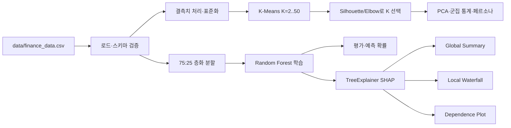
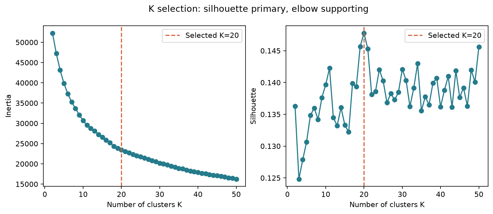
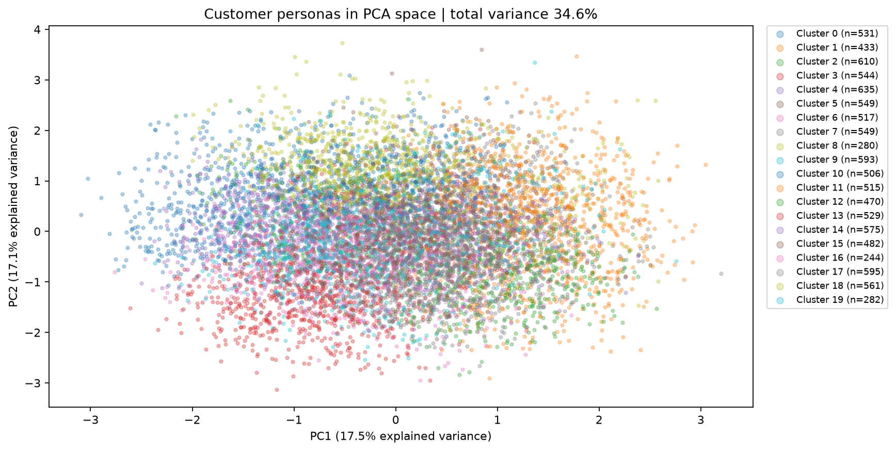
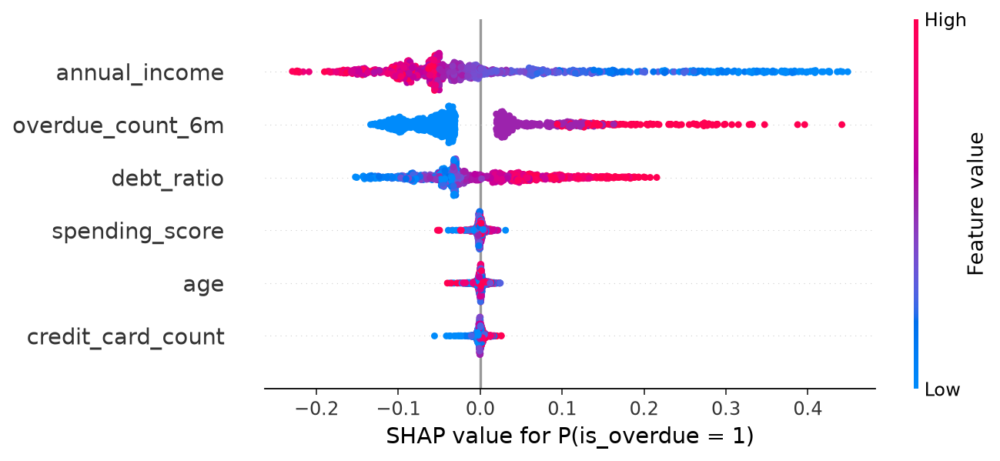
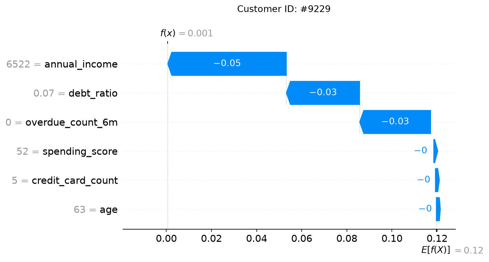
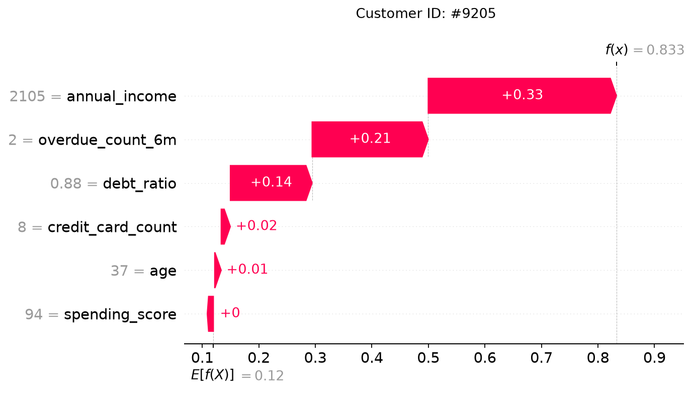
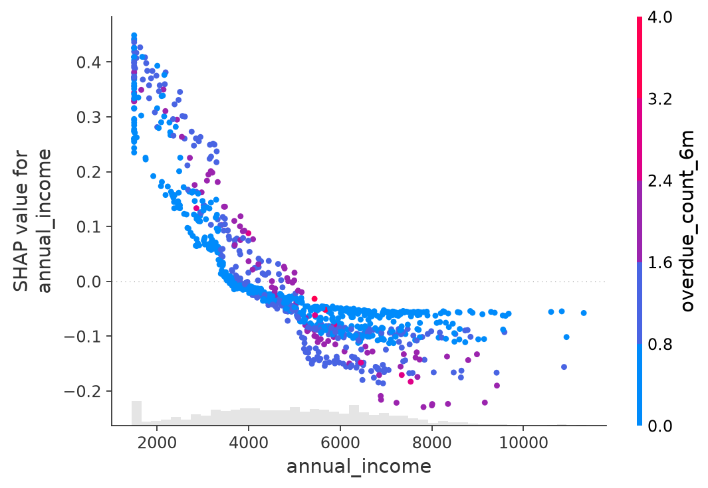
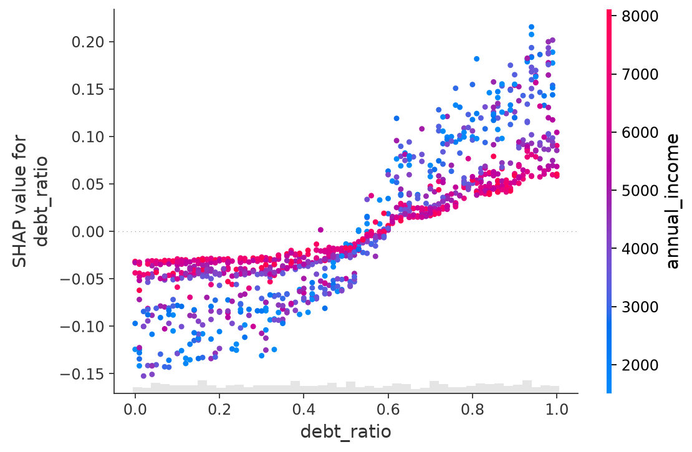
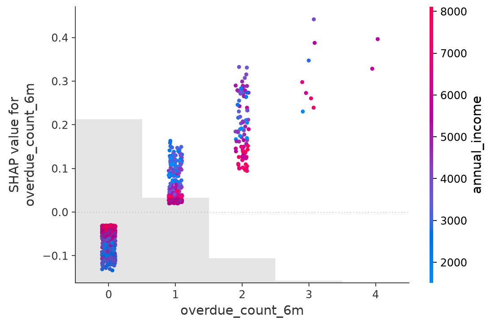

# 고객 위험 설명 파이프라인

## 프로젝트 소개

고객 특성으로 페르소나를 만들고, 연체 예측 모델이 승인·거절을 판단한 이유를 SHAP으로 설명한다. 분석 대상은 `data/finance_data.csv` 10,000건이며, `credit_score`와 `is_overdue`는 입력 변수에서 제외한다.

## 핵심 특징

- K-Means 군집화: 표준화된 6개 입력 변수로 K=2~50을 비교하고 Silhouette를 우선해 K=20을 선택한다.
- PCA 시각화: 군집을 2차원으로 표현하고 PC별 설명 분산을 표시한다.
- 분류와 XAI: scikit-learn Random Forest, TreeExplainer, Summary·Waterfall·Dependence Plot을 사용한다.
- 비즈니스 해석: 군집별 상담 방향과 고객별 위험 요인을 분리해 제안한다.

## 아키텍처



## 실행

```bash
python3.13 -m venv .venv
source .venv/bin/activate
python -m pip install -r requirements.txt
python analysis_clustering.py --data data/finance_data.csv
python analysis_shap.py --data data/finance_data.csv
python -m unittest discover -s tests
```

분석 순서는 `analysis_clustering.py` → `analysis_shap.py`다. 다른 CSV를 사용할 때 두 명령에 같은 `--data`를 지정한다.

## 분석 결과

### 군집 수와 PCA



K=2~50에서 같은 seed와 최대 2,000개 표본으로 비교했다. Silhouette 최고값은 **K=20, 0.1478**이며, Elbow는 보조 근거로 사용했다. 점수가 낮아 군집 간 경계가 강하지 않으므로 페르소나는 상담 대상의 요약으로만 사용한다.



PC1은 17.47%, PC2는 17.13%, 두 축은 전체 분산의 34.61%를 설명한다. PC1·PC2는 원본 변수 하나가 아니라 여러 변수의 선형 결합이므로 소득이나 위험 점수로 직접 해석하지 않는다.

### 군집 요약

| 군집 | 페르소나 요약 | 인원 | 관측 연체율 |
| --- | --- | ---: | ---: |
| C0 | 연령 낮음 · 소득 높음 | 531 | 1.88% |
| C1 | 연체이력 많음 · 소비점수 높음 | 433 | 21.71% |
| C2 | 다카드 · 소비점수 낮음 | 610 | 3.11% |
| C3 | 부채비율 낮음 · 소비점수 낮음 | 544 | 0.37% |
| C4 | 연령 낮음 · 부채비율 높음 | 635 | 26.14% |
| C5 | 소비점수 높음 · 부채비율 낮음 | 549 | 0.18% |
| C6 | 소수카드 · 소득 낮음 | 517 | 10.06% |
| C7 | 부채비율 낮음 · 소비점수 높음 | 549 | 10.02% |
| C8 | 연체이력 많음 · 소비점수 높음 | 280 | 30.00% |
| C9 | 부채비율 높음 · 소수카드 | 593 | 24.45% |
| C10 | 연령 낮음 · 부채비율 높음 | 506 | 1.78% |
| C11 | 다카드 · 소비점수 높음 | 515 | 0.00% |
| C12 | 연령 높음 · 소비점수 높음 | 470 | 1.49% |
| C13 | 소비점수 낮음 · 소수카드 | 529 | 23.25% |
| C14 | 다카드 · 부채비율 낮음 | 575 | 6.43% |
| C15 | 소득 높음 · 연령 높음 | 482 | 2.49% |
| C16 | 연체이력 많음 · 부채비율 높음 | 244 | 71.31% |
| C17 | 연령 높음 · 부채비율 높음 | 595 | 26.89% |
| C18 | 연령 낮음 · 소비점수 낮음 | 561 | 0.00% |
| C19 | 연체이력 많음 · 소비점수 낮음 | 282 | 18.09% |

군집 통계의 전체 값은 [`cluster_statistics.csv`](outputs/clustering/cluster_statistics.csv), 군집 배정은 [`cluster_assignments.csv`](outputs/clustering/cluster_assignments.csv)에 있다. 군집 연체율은 타겟을 이용한 사후 요약이며 군집 생성 입력에는 타겟을 사용하지 않았다.

### Global SHAP



| 순위 | 변수 | 평균 절대 SHAP | 해석 |
| ---: | --- | ---: | --- |
| 1 | 연 소득 | 0.10173 | 큰 값이 위험을 낮추는 방향 |
| 2 | 최근 6개월 연체 횟수 | 0.07602 | 큰 값이 위험을 높이는 방향 |
| 3 | 부채비율 | 0.05894 | 큰 값이 위험을 높이는 방향 |

불순도 중요도는 트리 분할 기여를 집계하고 방향을 제공하지 않는다. SHAP은 각 예측을 기준값에서 얼마나 올리거나 내렸는지 보여주므로 두 순위가 달라질 수 있다.

### Local SHAP

Waterfall은 개인 한 명의 예측 설명이다. 그래프 상단의 `Customer ID`는 CSV의 0 기반 행 번호다.

| 사례 | 고객 | 판정 | 예측 연체 확률 | 주요 이유 |
| --- | ---: | --- | ---: | --- |
| 승인 | #9229 | 저위험 | 0.06% | 소득 6,522만원, 부채비율 7%, 최근 연체 0회가 위험을 낮춤 |
| 거절 | #9205 | 고위험 | 83.27% | 소득 2,105만원, 부채비율 88%, 최근 연체 2회가 위험을 높임 |




Global은 전체 고객에서 중요한 변수를 보여주고, Local은 특정 고객의 판정 이유를 보여준다. 모델 확률은 상담 준비 자료이지 실제 상환 능력이나 자동 승인·거절의 단독 근거가 아니다.

### Dependence 인사이트



- 연 소득 하위 구간의 평균 SHAP은 **+0.2067**, 상위 구간은 **-0.0977**이다. 모델은 큰 소득을 상대적으로 낮은 위험과 연결했다.



- 부채비율 하위 구간의 평균 SHAP은 **-0.0616**, 상위 구간은 **+0.0930**이다. 부채 부담이 높은 고객을 상환 일정 점검 대상으로 우선 검토할 근거가 된다.



- 최근 6개월 연체 0회의 평균 SHAP은 **-0.0640**, 1회 이상은 **+0.0935**다. 최근 납부 이력 확인과 결제일 알림 안내에 활용할 수 있다.

## 비즈니스 제언

- 연체율이 높은 C16·C8·C17·C4 등은 상환 일정, 연체 해소 여부, 소득 정보 최신성을 먼저 확인한다. 결제일 알림·자동이체·상환 상담을 고객 상황에 맞춰 제안한다.
- 연체율이 낮은 C3·C5·C11·C18 등은 위험이 낮다는 이유로 추가 대출을 권하지 않는다. 결제·알림 편의와 고객 관심사를 확인하는 유지 캠페인을 우선 검토한다.
- 군집은 접촉 목적을 정하는 도구이고, 실제 안내는 개인별 예측·최근 상황·고객 동의를 함께 확인한다.

## 한계와 검증

- 합성 데이터 기반 결과이므로 실제 고객 성과를 보장하지 않는다.
- 단일 75:25 분할이며 시간 기준 검증, 교차검증, 확률 보정, 공정성 분석은 추가 과제다.
- 실제 도입 전에는 운영 데이터로 군집 안정성·집단별 오류율을 확인하고, 군집별 상담군과 대조군을 무작위 배정해 연체율·도달률·불만률을 측정한다.

## 산출물

- `outputs/clustering/`: K 점수, K 선택 그래프, PCA, 군집 배정·통계
- `outputs/model/`: 학습 행과 홀드아웃 예측
- `outputs/shap/`: Summary, 변수 중요도, Dependence, 고객별 Waterfall
- `outputs/validation/validation.json`: 산출물 검증 기록
