# 고객 위험 설명 파이프라인

## 프로젝트 소개

고객 10,000명의 여섯 입력 변수로 페르소나를 만들고, 연체 분류 모델의 판정 근거를 SHAP으로 설명합니다. 군집 수는 K=20, 최대 silhouette는 0.1478이며, PCA 두 축은 분산의 34.6%를 보존합니다. 홀드아웃 ROC-AUC는 0.9490, Average Precision은 0.6979입니다. 전체 예측에 크게 기여한 변수는 연 소득(만원), 최근 6개월 연체 횟수, 부채비율입니다. 군집은 고객 특성의 요약이며, 개별 위험 판정은 분류 확률과 해당 고객의 기여도를 함께 확인해야 합니다.

## 핵심 특징

- 타겟 두 개를 제외한 여섯 원본 변수만 사용하며, 외부 데이터 병합·증강·입력 컬럼 추가를 하지 않습니다.
- 표준화 → K-Means → PCA → 군집 통계 → 홀드아웃 분류 → Global/Local SHAP을 연결합니다.
- 모든 그래프는 PNG, 수치 근거는 CSV/JSON으로 저장하며 README는 측정 결과에서 생성합니다.

## 아키텍처

```text
finance_data.csv
  ├─ analysis_clustering.py → src/data.py + src/clustering.py → 군집·PCA·통계
  └─ analysis_shap.py → src/modeling.py + src/shap_analysis.py → 평가·SHAP
       └─ build_report.py → src/reporting.py → README.md
```

## 실행 방법

Python 3.13에서 검증했습니다. 정확한 패키지 버전은 `requirements.txt`에 고정되어 있습니다.

```bash
python3.13 -m venv .venv
source .venv/bin/activate
python -m pip install -r requirements.txt
python analysis_clustering.py --data data/finance_data.csv
python analysis_shap.py --data data/finance_data.csv
python build_report.py --provenance '사용자 승인에 따라 mission.md의 생성 코드(seed=42)를 재현한 합성 데이터 10,000건입니다. 기존 Mission 23 CSV는 제공되지 않아 해당 파일과의 동일성은 확인할 수 없습니다. 재현 스크립트는 scripts/reproduce_mission_data.py이며 입력 파일은 data/finance_data.csv입니다.'
python -m unittest discover -s tests
```

다른 원본을 사용할 때 두 분석 명령에 같은 `--data`를 지정합니다. 실행 순서가 바뀌거나 CSV 해시가 다르면 실패합니다. `--output`으로 출력 폴더를 바꿀 수 있고, 리포트는 `--destination`으로 별도 저장할 수 있습니다. 추론 모델 파일은 불러오지 않으며 동일한 데이터·시드·패키지로 다시 학습합니다.

제공된 생성 코드를 다시 실행하려면 아래 명령을 사용합니다. 기존 파일을 보호하기 위해 새 경로를 지정합니다. 재현한 CSV를 분석하려면 두 분석 명령의 `--data`도 해당 경로로 맞춥니다.

```bash
python scripts/reproduce_mission_data.py --output /tmp/finance_data_reproduced.csv
```

## 데이터와 평가 설계

사용자 승인에 따라 mission.md의 생성 코드(seed=42)를 재현한 합성 데이터 10,000건입니다. 기존 Mission 23 CSV는 제공되지 않아 해당 파일과의 동일성은 확인할 수 없습니다. 재현 스크립트는 scripts/reproduce_mission_data.py이며 입력 파일은 data/finance_data.csv입니다.

입력 SHA-256: `4ddf83dd154ee23bb2374a2bbc1aa56d537ef7ad5114c2f162078756542fe1a2`. 행 ID는 CSV의 0 기반 행 번호이며 개인 식별자가 아닙니다. `credit_score`와 `is_overdue`를 군집화와 분류 입력에서 모두 제외합니다. 신용 점수는 타겟 생성에 직접 쓰였으므로 입력에 넣으면 타겟 생성 규칙을 우회적으로 노출합니다. 결측치는 중앙값으로 대체하며 임의의 이상치 제거는 하지 않습니다. 이번 입력의 결측치 합계는 0개입니다. 군집화는 전체 고객에 대한 기술적 분석이므로 전체 입력에 전처리를 적합합니다. 분류는 stratified 75:25, seed=42로 분리하고 중앙값을 학습 행에서만 계산합니다. 군집 ID와 PCA 좌표는 분류 입력에 추가하지 않습니다.

기존 Mission 23 모델 파일이 없어 RandomForestClassifier(200 trees, max_depth=8, min_samples_leaf=5)를 새로 학습한 실행입니다. 원본 모델 재사용 요구에 대한 대체 실행임을 구분해야 합니다. 임계값은 0.5로 사전에 고정하며 거절은 P(is_overdue=1) ≥ 0.5, 승인은 그 미만입니다. 과제의 “확률이5 이상”은 0.5의 오기로 해석했습니다. 과제용 판정이며 실제 대출 승인 여부나 인과적 설명을 의미하지 않습니다.

| 지표 | 홀드아웃 결과 |
| --- | --- |
| 학습 / 평가 행 수 | 7500 / 2500 |
| 실제 연체율 / AP 무작위 기준 | 0.1200 |
| ROC-AUC | 0.9490 |
| Average Precision | 0.6979 |
| Precision / Recall @0.5 | 0.6927 / 0.5033 |
| Balanced accuracy | 0.7364 |
| Brier score | 0.0567 |
| 혼동행렬 [[TN, FP], [FN, TP]] | [[2133, 67], [149, 151]] |

불균형 데이터에서는 정확도만으로 성능을 판단하지 않습니다. AP는 연체율 기준선과 비교하고, 재현율은 놓치는 연체 고객을, 정밀도는 고위험 판정의 신뢰도를 보여줍니다. 현재 임계값에서는 실제 연체 고객 300명 중 149명을 놓쳤습니다. 따라서 ROC-AUC가 높다는 이유만으로 자동 판정에 충분하다고 볼 수 없습니다. 테스트 데이터를 이용한 임계값 최적화는 하지 않았습니다.

## 군집 수와 분리도


| K | Inertia | Silhouette |
| --- | --- | --- |
| 2 | 52274.2 | 0.1363 |
| 3 | 47231.9 | 0.1248 |
| 4 | 43140.5 | 0.1279 |
| 5 | 39830.6 | 0.1306 |
| 6 | 37296.4 | 0.1348 |
| 7 | 35279.3 | 0.1360 |
| 8 | 33690.8 | 0.1342 |
| 9 | 32081.5 | 0.1376 |
| 10 | 30668.6 | 0.1397 |
| 11 | 29534.9 | 0.1423 |
| 12 | 28806.7 | 0.1345 |
| 13 | 28088.3 | 0.1332 |
| 14 | 27275.8 | 0.1361 |
| 15 | 26570.8 | 0.1333 |
| 16 | 25859.5 | 0.1322 |
| 17 | 25249.8 | 0.1398 |
| 18 | 24372.1 | 0.1394 |
| 19 | 23862.3 | 0.1456 |
| 20 | 23461.0 | 0.1478 |
| 21 | 23049.7 | 0.1453 |
| 22 | 22717.0 | 0.1381 |
| 23 | 22342.6 | 0.1386 |
| 24 | 22025.4 | 0.1420 |
| 25 | 21743.0 | 0.1403 |
| 26 | 21448.0 | 0.1368 |
| 27 | 21131.2 | 0.1383 |
| 28 | 20802.5 | 0.1373 |
| 29 | 20532.5 | 0.1385 |
| 30 | 20185.7 | 0.1421 |
| 31 | 19987.7 | 0.1403 |
| 32 | 19730.8 | 0.1362 |
| 33 | 19411.8 | 0.1391 |
| 34 | 19215.0 | 0.1430 |
| 35 | 18861.0 | 0.1356 |
| 36 | 18766.8 | 0.1378 |
| 37 | 18501.5 | 0.1365 |
| 38 | 18205.0 | 0.1399 |
| 39 | 18059.7 | 0.1407 |
| 40 | 17922.8 | 0.1362 |
| 41 | 17707.5 | 0.1388 |
| 42 | 17587.8 | 0.1410 |
| 43 | 17311.2 | 0.1361 |
| 44 | 17194.2 | 0.1418 |
| 45 | 17112.8 | 0.1377 |
| 46 | 16932.4 | 0.1392 |
| 47 | 16811.4 | 0.1363 |
| 48 | 16567.8 | 0.1420 |
| 49 | 16487.3 | 0.1401 |
| 50 | 16257.9 | 0.1456 |

K=2~50 범위를 탐색하고, 같은 seed=42의 최대 2,000개 행에서 silhouette를 비교해 최대인 K=20를 선택했습니다. Inertia는 군집 내 중심까지의 제곱거리 합이며 K가 증가하면 줄어드는 것이 정상입니다. Elbow 곡선은 감소 폭이 완만해지는지 확인하는 보조 근거로만 사용했고, 명확한 꺾임을 전제하지 않았습니다. 페르소나 이름에는 전체 대비 평균 차이가 0.25 표준편차 이상인 변수 중 최대 두 개를 사용합니다. 이는 통계적 유의성 기준이 아닌 미미한 차이의 과장을 피하기 위한 명명 규칙이며, 해당 변수가 없으면 차이가 가장 큰 한 개를 씁니다. 이름을 보기 좋게 만들기 위해 K를 변경하지 않았습니다. Silhouette 0.1478는 약한 분리와 군집 간 중첩을 시사합니다. 고객 집단이 자연적으로 존재한다고 단정할 수는 없습니다.


PC1=17.47%, PC2=17.13%, 합계=34.61%이며 2차원 투영에서 분산의 65.39%를 버립니다. 투영 좌표에서 같은 라벨의 silhouette는 -0.1117입니다. 산점도에서 겹치는 점만으로 원래 6차원 군집 품질을 판단하면 안 됩니다. PC는 표준화된 여섯 원본 변수의 선형결합이지 소득이나 부채비율 자체가 아닙니다. `outputs/clustering/pca_loadings.csv`의 계수는 축의 구성을 보여주지만 위험 기여도는 아닙니다. PCA의 부호도 임의적이므로 PC1 증가를 위험 증가로 읽지 않습니다.

스케일링 없이 소득 수천 단위와 0~1 부채비율의 유클리드 거리를 계산하면 소득이 거리를 지배합니다. StandardScaler로 평균 0·표준편차 1을 만들어 각 변수의 단위 차이를 제거했습니다. 표준화는 이상치의 영향을 없애지는 않으므로 실제 데이터 적용 시 별도 점검이 필요합니다.

## 군집 요약과 페르소나

| 군집 / 페르소나 | 인원 | 소득 평균(만원) | 부채 평균 | 연체횟수 평균 | 관측 연체율 |
| --- | --- | --- | --- | --- | --- |
| C0 연령 낮은 · 소득 높은 | 531 | 6662 | 0.733 | 0.33 | 1.88% |
| C1 연체이력 많은 · 소비점수 높은 | 433 | 3989 | 0.289 | 1.33 | 21.71% |
| C2 다카드 · 소비점수 낮은 | 610 | 6316 | 0.731 | 0.34 | 3.11% |
| C3 부채비율 낮은 · 소비점수 낮은 | 544 | 6376 | 0.253 | 0.33 | 0.37% |
| C4 연령 낮은 · 부채비율 높은 | 635 | 3649 | 0.725 | 0.37 | 26.14% |
| C5 소비점수 높은 · 부채비율 낮은 | 549 | 6316 | 0.261 | 0.23 | 0.18% |
| C6 소수카드 · 소득 낮은 | 517 | 3394 | 0.302 | 0.26 | 10.06% |
| C7 부채비율 낮은 · 소비점수 높은 | 549 | 3690 | 0.250 | 0.34 | 10.02% |
| C8 연체이력 많은 · 소비점수 높은 | 280 | 5782 | 0.509 | 2.19 | 30.00% |
| C9 부채비율 높은 · 소수카드 | 593 | 3913 | 0.771 | 0.35 | 24.45% |
| C10 연령 낮은 · 부채비율 높은 | 506 | 6418 | 0.748 | 0.32 | 1.78% |
| C11 다카드 · 소비점수 높은 | 515 | 6760 | 0.281 | 0.37 | 0.00% |
| C12 연령 높은 · 소비점수 높은 | 470 | 3781 | 0.286 | 0.00 | 1.49% |
| C13 소비점수 낮은 · 소수카드 | 529 | 3681 | 0.735 | 0.26 | 23.25% |
| C14 다카드 · 부채비율 낮은 | 575 | 3747 | 0.262 | 0.32 | 6.43% |
| C15 소득 높은 · 연령 높은 | 482 | 6818 | 0.750 | 0.43 | 2.49% |
| C16 연체이력 많은 · 부채비율 높은 | 244 | 3647 | 0.755 | 2.19 | 71.31% |
| C17 연령 높은 · 부채비율 높은 | 595 | 3586 | 0.738 | 0.34 | 26.89% |
| C18 연령 낮은 · 소비점수 낮은 | 561 | 6505 | 0.262 | 0.30 | 0.00% |
| C19 연체이력 많은 · 소비점수 낮은 | 282 | 5955 | 0.325 | 2.23 | 18.09% |

관측 연체율은 군집을 만든 뒤 타겟으로 요약한 기술통계입니다. 군집 수 선정이나 거리 계산에 사용하지 않았습니다. 전체 변수의 평균·중앙값·표준편차는 `outputs/clustering/cluster_statistics.csv`에 있습니다.

### C0: 연령 낮은 · 소득 높은

- 특징: 나이 31.86 (전체 대비 -0.89 표준편차), 연 소득(만원) 6661.84 (전체 대비 +0.84 표준편차).
- 해석: 전체의 5.3%를 차지하는 상대적 특성 집단이며, 군집 내 모든 고객이 같은 위험을 갖지는 않습니다.
- 연결: 아래 `cluster_0` 사례는 이 군집 평균에 가까운 평가 고객입니다. 개별 기여도로 설명을 확인합니다.

### C1: 연체이력 많은 · 소비점수 높은

- 특징: 최근 6개월 연체 횟수 1.33 (전체 대비 +1.15 표준편차), 소비 점수 71.31 (전체 대비 +0.75 표준편차).
- 해석: 전체의 4.3%를 차지하는 상대적 특성 집단이며, 군집 내 모든 고객이 같은 위험을 갖지는 않습니다.
- 연결: 아래 `cluster_1` 사례는 이 군집 평균에 가까운 평가 고객입니다. 개별 기여도로 설명을 확인합니다.

### C2: 다카드 · 소비점수 낮은

- 특징: 카드 수 7.16 (전체 대비 +0.83 표준편차), 소비 점수 26.28 (전체 대비 -0.82 표준편차).
- 해석: 전체의 6.1%를 차지하는 상대적 특성 집단이며, 군집 내 모든 고객이 같은 위험을 갖지는 않습니다.
- 연결: 아래 `cluster_2` 사례는 이 군집 평균에 가까운 평가 고객입니다. 개별 기여도로 설명을 확인합니다.

### C3: 부채비율 낮은 · 소비점수 낮은

- 특징: 부채비율 0.25 (전체 대비 -0.86 표준편차), 소비 점수 25.40 (전체 대비 -0.85 표준편차).
- 해석: 전체의 5.4%를 차지하는 상대적 특성 집단이며, 군집 내 모든 고객이 같은 위험을 갖지는 않습니다.
- 연결: 아래 `cluster_3` 사례는 이 군집 평균에 가까운 평가 고객입니다. 개별 기여도로 설명을 확인합니다.

### C4: 연령 낮은 · 부채비율 높은

- 특징: 나이 32.25 (전체 대비 -0.86 표준편차), 부채비율 0.72 (전체 대비 +0.78 표준편차).
- 해석: 전체의 6.3%를 차지하는 상대적 특성 집단이며, 군집 내 모든 고객이 같은 위험을 갖지는 않습니다.
- 연결: 아래 `cluster_4` 사례는 이 군집 평균에 가까운 평가 고객입니다. 개별 기여도로 설명을 확인합니다.

### C5: 소비점수 높은 · 부채비율 낮은

- 특징: 소비 점수 74.79 (전체 대비 +0.87 표준편차), 부채비율 0.26 (전체 대비 -0.84 표준편차).
- 해석: 전체의 5.5%를 차지하는 상대적 특성 집단이며, 군집 내 모든 고객이 같은 위험을 갖지는 않습니다.
- 연결: 아래 `cluster_5` 사례는 이 군집 평균에 가까운 평가 고객입니다. 개별 기여도로 설명을 확인합니다.

### C6: 소수카드 · 소득 낮은

- 특징: 카드 수 2.68 (전체 대비 -0.91 표준편차), 연 소득(만원) 3393.70 (전체 대비 -0.85 표준편차).
- 해석: 전체의 5.2%를 차지하는 상대적 특성 집단이며, 군집 내 모든 고객이 같은 위험을 갖지는 않습니다.
- 연결: 아래 `cluster_6` 사례는 이 군집 평균에 가까운 평가 고객입니다. 개별 기여도로 설명을 확인합니다.

### C7: 부채비율 낮은 · 소비점수 높은

- 특징: 부채비율 0.25 (전체 대비 -0.87 표준편차), 소비 점수 74.77 (전체 대비 +0.87 표준편차).
- 해석: 전체의 5.5%를 차지하는 상대적 특성 집단이며, 군집 내 모든 고객이 같은 위험을 갖지는 않습니다.
- 연결: 아래 `cluster_7` 사례는 이 군집 평균에 가까운 평가 고객입니다. 개별 기여도로 설명을 확인합니다.

### C8: 연체이력 많은 · 소비점수 높은

- 특징: 최근 6개월 연체 횟수 2.19 (전체 대비 +2.35 표준편차), 소비 점수 78.01 (전체 대비 +0.98 표준편차).
- 해석: 전체의 2.8%를 차지하는 상대적 특성 집단이며, 군집 내 모든 고객이 같은 위험을 갖지는 않습니다.
- 연결: 아래 `cluster_8` 사례는 이 군집 평균에 가까운 평가 고객입니다. 개별 기여도로 설명을 확인합니다.

### C9: 부채비율 높은 · 소수카드

- 특징: 부채비율 0.77 (전체 대비 +0.94 표준편차), 카드 수 2.72 (전체 대비 -0.89 표준편차).
- 해석: 전체의 5.9%를 차지하는 상대적 특성 집단이며, 군집 내 모든 고객이 같은 위험을 갖지는 않습니다.
- 연결: 아래 `cluster_9` 사례는 이 군집 평균에 가까운 평가 고객입니다. 개별 기여도로 설명을 확인합니다.

### C10: 연령 낮은 · 부채비율 높은

- 특징: 나이 31.10 (전체 대비 -0.94 표준편차), 부채비율 0.75 (전체 대비 +0.86 표준편차).
- 해석: 전체의 5.1%를 차지하는 상대적 특성 집단이며, 군집 내 모든 고객이 같은 위험을 갖지는 않습니다.
- 연결: 아래 `cluster_10` 사례는 이 군집 평균에 가까운 평가 고객입니다. 개별 기여도로 설명을 확인합니다.

### C11: 다카드 · 소비점수 높은

- 특징: 카드 수 7.51 (전체 대비 +0.97 표준편차), 소비 점수 76.48 (전체 대비 +0.93 표준편차).
- 해석: 전체의 5.1%를 차지하는 상대적 특성 집단이며, 군집 내 모든 고객이 같은 위험을 갖지는 않습니다.
- 연결: 아래 `cluster_11` 사례는 이 군집 평균에 가까운 평가 고객입니다. 개별 기여도로 설명을 확인합니다.

### C12: 연령 높은 · 소비점수 높은

- 특징: 나이 57.37 (전체 대비 +0.89 표준편차), 소비 점수 74.97 (전체 대비 +0.87 표준편차).
- 해석: 전체의 4.7%를 차지하는 상대적 특성 집단이며, 군집 내 모든 고객이 같은 위험을 갖지는 않습니다.
- 연결: 아래 `cluster_12` 사례는 이 군집 평균에 가까운 평가 고객입니다. 개별 기여도로 설명을 확인합니다.

### C13: 소비점수 낮은 · 소수카드

- 특징: 소비 점수 23.20 (전체 대비 -0.93 표준편차), 카드 수 2.67 (전체 대비 -0.91 표준편차).
- 해석: 전체의 5.3%를 차지하는 상대적 특성 집단이며, 군집 내 모든 고객이 같은 위험을 갖지는 않습니다.
- 연결: 아래 `cluster_13` 사례는 이 군집 평균에 가까운 평가 고객입니다. 개별 기여도로 설명을 확인합니다.

### C14: 다카드 · 부채비율 낮은

- 특징: 카드 수 7.27 (전체 대비 +0.88 표준편차), 부채비율 0.26 (전체 대비 -0.83 표준편차).
- 해석: 전체의 5.8%를 차지하는 상대적 특성 집단이며, 군집 내 모든 고객이 같은 위험을 갖지는 않습니다.
- 연결: 아래 `cluster_14` 사례는 이 군집 평균에 가까운 평가 고객입니다. 개별 기여도로 설명을 확인합니다.

### C15: 소득 높은 · 연령 높은

- 특징: 연 소득(만원) 6818.21 (전체 대비 +0.92 표준편차), 나이 57.39 (전체 대비 +0.89 표준편차).
- 해석: 전체의 4.8%를 차지하는 상대적 특성 집단이며, 군집 내 모든 고객이 같은 위험을 갖지는 않습니다.
- 연결: 아래 `cluster_15` 사례는 이 군집 평균에 가까운 평가 고객입니다. 개별 기여도로 설명을 확인합니다.

### C16: 연체이력 많은 · 부채비율 높은

- 특징: 최근 6개월 연체 횟수 2.19 (전체 대비 +2.35 표준편차), 부채비율 0.76 (전체 대비 +0.88 표준편차).
- 해석: 전체의 2.4%를 차지하는 상대적 특성 집단이며, 군집 내 모든 고객이 같은 위험을 갖지는 않습니다.
- 연결: 아래 `cluster_16` 사례는 이 군집 평균에 가까운 평가 고객입니다. 개별 기여도로 설명을 확인합니다.

### C17: 연령 높은 · 부채비율 높은

- 특징: 나이 56.71 (전체 대비 +0.84 표준편차), 부채비율 0.74 (전체 대비 +0.82 표준편차).
- 해석: 전체의 5.9%를 차지하는 상대적 특성 집단이며, 군집 내 모든 고객이 같은 위험을 갖지는 않습니다.
- 연결: 아래 `cluster_17` 사례는 이 군집 평균에 가까운 평가 고객입니다. 개별 기여도로 설명을 확인합니다.

### C18: 연령 낮은 · 소비점수 낮은

- 특징: 나이 32.05 (전체 대비 -0.88 표준편차), 소비 점수 25.24 (전체 대비 -0.86 표준편차).
- 해석: 전체의 5.6%를 차지하는 상대적 특성 집단이며, 군집 내 모든 고객이 같은 위험을 갖지는 않습니다.
- 연결: 아래 `cluster_18` 사례는 이 군집 평균에 가까운 평가 고객입니다. 개별 기여도로 설명을 확인합니다.

### C19: 연체이력 많은 · 소비점수 낮은

- 특징: 최근 6개월 연체 횟수 2.23 (전체 대비 +2.40 표준편차), 소비 점수 24.14 (전체 대비 -0.90 표준편차).
- 해석: 전체의 2.8%를 차지하는 상대적 특성 집단이며, 군집 내 모든 고객이 같은 위험을 갖지는 않습니다.
- 연결: 아래 `cluster_19` 사례는 이 군집 평균에 가까운 평가 고객입니다. 개별 기여도로 설명을 확인합니다.

## Global SHAP 해석


학습에 사용하지 않은 고객 중 seed=42로 1,000명을 추출했습니다. Summary의 각 점은 고객 한 명이고 빨강은 큰 입력값, 파랑은 작은 입력값입니다. 양의 SHAP은 연체 확률을 기준값보다 올리고 음의 SHAP은 내립니다. Global은 전체적으로 무엇이 모델을 움직이는지, Local은 특정 고객이 왜 그 확률을 받았는지 설명합니다.

| 변수 | 평균 절대 SHAP | 불순도 중요도 |
| --- | --- | --- |
| 연 소득(만원) | 0.10173 | 0.47678 |
| 최근 6개월 연체 횟수 | 0.07602 | 0.22787 |
| 부채비율 | 0.05894 | 0.17820 |
| 소비 점수 | 0.00376 | 0.04825 |
| 나이 | 0.00362 | 0.04243 |
| 카드 수 | 0.00318 | 0.02647 |

| 상위 3개 변수 | 하위 사분위 평균 SHAP | 상위 사분위 평균 SHAP | 큰 값의 상대적 방향 |
| --- | --- | --- | --- |
| 연 소득(만원) | +0.2067 | -0.0977 | 위험 감소 |
| 최근 6개월 연체 횟수 | -0.0640 | +0.0935 | 위험 증가 |
| 부채비율 | -0.0616 | +0.0930 | 위험 증가 |

Random Forest의 불순도 중요도는 학습 트리에서 분할로 줄어든 불순도를 누적·정규화하며 방향성이 없습니다. SHAP은 특성 조합에 대한 예측 차이의 가중 기여도를 구하고, 여기서는 TreeExplainer의 tree_path_dependent 방식으로 학습 트리의 경로 분포를 사용합니다. 평균 절댓값은 영향의 크기이며 각 고객의 부호가 방향을 나타냅니다. 고유값이 많은 변수에 대한 불순도 중요도의 편향, 상관 변수 사이의 기여 배분, 평가 표본 차이 때문에 순위가 달라질 수 있습니다.

## Dependence 해석


연 소득(만원)는 Summary 상위 변수로 선택했습니다. 하위 사분위 구간(≤3542.75)의 평균 기여는 +0.2067, 상위 사분위 구간(≥6315.25)은 -0.0977로, 큰 값의 구간이 상대적으로 연체 확률을 낮추는 방향입니다. 이는 다른 조건이 섞인 모델 내 연관성이며, 해당 변수만 바꾸면 이만큼 위험이 변한다는 인과 효과가 아닙니다. 같은 입력값에서도 점이 수직으로 퍼지는 것은 다른 입력과 상호작용이 있음을 보여주며, 색상은 자동 선택된 다른 입력값입니다. 사분위 경계가 같은 이산형 변수에서는 두 비교 집단이 겹칠 수 있습니다.


부채비율는 비즈니스상 중요한 부채 부담 변수로 선택했습니다. 하위 사분위 구간(≤0.25)의 평균 기여는 -0.0616, 상위 사분위 구간(≥0.76)은 +0.0930로, 큰 값의 구간이 상대적으로 연체 확률을 높이는 방향입니다. 이는 다른 조건이 섞인 모델 내 연관성이며, 해당 변수만 바꾸면 이만큼 위험이 변한다는 인과 효과가 아닙니다. 같은 입력값에서도 점이 수직으로 퍼지는 것은 다른 입력과 상호작용이 있음을 보여주며, 색상은 자동 선택된 다른 입력값입니다. 사분위 경계가 같은 이산형 변수에서는 두 비교 집단이 겹칠 수 있습니다.


최근 6개월 연체 횟수는 Summary 상위 변수로 선택했습니다. 하위 사분위 구간(≤0.00)의 평균 기여는 -0.0640, 상위 사분위 구간(≥1.00)은 +0.0935로, 큰 값의 구간이 상대적으로 연체 확률을 높이는 방향입니다. 이는 다른 조건이 섞인 모델 내 연관성이며, 해당 변수만 바꾸면 이만큼 위험이 변한다는 인과 효과가 아닙니다. 같은 입력값에서도 점이 수직으로 퍼지는 것은 다른 입력과 상호작용이 있음을 보여주며, 색상은 자동 선택된 다른 입력값입니다. 사분위 경계가 같은 이산형 변수에서는 두 비교 집단이 겹칠 수 있습니다.

## Local 사례: 승인·거절과 군집 대표 고객

승인/거절 예시는 평가 고객 중 예측 확률이 가장 낮거나 높은 고객으로, 전형적 고객을 의미하지 않습니다. 군집별 예시는 군집의 전체 평균과 표준화 거리가 가장 가까운 평가 고객을 별도로 골랐습니다. 훈련 표준편차로 거리를 나누며 원본 단위를 유지한 피처값과 확률 기여를 아래에 함께 제시합니다. 결측치가 있었다면 표의 값은 학습 중앙값으로 대체한 모델 입력입니다.

`P(연체=1) = 기준 기대값 + 각 변수 SHAP의 합`입니다. 이 Random Forest의 raw 출력은 로그오즈가 아닌 확률이며, +0.10은 기준값에 10%p를 더한다는 뜻입니다. Global 표본의 최대 합산 오차는 4.88e-15이며 모든 Local 사례도 1e-6 허용오차로 검증했습니다.

### approval: 고객 #9229 / C3


판정: **승인(저위험)**, 예측 연체 확률 **0.06%**, 관측 연체 라벨 0. 기준값 0.119657 + 기여도 합 -0.119058 = 0.000600.

| 변수 | 모델 입력값 | SHAP 기여(확률 %p) |
| --- | --- | --- |
| 나이 | 63.00 | -0.041 |
| 연 소득(만원) | 6522.00 | -5.259 |
| 소비 점수 | 52.00 | -0.136 |
| 부채비율 | 0.07 | -3.249 |
| 카드 수 | 5.00 | -0.072 |
| 최근 6개월 연체 횟수 | 0.00 | -3.148 |

주요 이유: 연 소득(만원) 6522.00가 기준 확률을 5.26%p 낮춤; 부채비율 0.07가 기준 확률을 3.25%p 낮춤; 최근 6개월 연체 횟수 0.00가 기준 확률을 3.15%p 낮춤.

**영업팀 설명 예시**

> 이 고객의 연체 가능성을 모델은 0.06%로 추정해 저위험으로 분류했습니다. 모델은 연 소득 6,522만원, 부채비율 7%, 최근 6개월 연체 0회 정보를 위험을 낮추는 근거로 반영했습니다. 이 중 가장 크게 작용한 정보는 연 소득 6,522만원입니다. 이는 현재 입력된 정보에 대한 모델의 판단이며, 고객의 실제 상환 가능성은 추가 확인이 필요합니다.

**사례의 의미:** C3 ‘부채비율 낮은 · 소비점수 낮은’에 속하며, 평가 고객 중 가장 낮은 예측 확률을 가진 설명용 사례입니다. 확률의 양 끝에서 어떤 입력이 판정을 이끄는지 보여주지만, 군집 전체의 전형으로 해석하지 않습니다.

**상담에서 확인할 내용:** 기존 거래에서 불편한 점과 원하는 혜택을 확인하고, 알림·결제 편의 등 유지 중심의 안내를 제공합니다. 낮은 연체 추정만으로 추가 대출이나 한도 확대를 권할 근거는 없으며, 상품 관심도는 따로 확인합니다.

### rejection: 고객 #9205 / C8


판정: **거절(고위험)**, 예측 연체 확률 **83.27%**, 관측 연체 라벨 1. 기준값 0.119657 + 기여도 합 +0.713071 = 0.832728.

| 변수 | 모델 입력값 | SHAP 기여(확률 %p) |
| --- | --- | --- |
| 나이 | 37.00 | +1.150 |
| 연 소득(만원) | 2105.00 | +33.300 |
| 소비 점수 | 94.00 | +0.233 |
| 부채비율 | 0.88 | +14.462 |
| 카드 수 | 8.00 | +1.620 |
| 최근 6개월 연체 횟수 | 2.00 | +20.542 |

주요 이유: 연 소득(만원) 2105.00가 기준 확률을 33.30%p 높임; 최근 6개월 연체 횟수 2.00가 기준 확률을 20.54%p 높임; 부채비율 0.88가 기준 확률을 14.46%p 높임.

**영업팀 설명 예시**

> 이 고객의 연체 가능성을 모델은 83.27%로 추정해 고위험으로 분류했습니다. 모델은 연 소득 2,105만원, 최근 6개월 연체 2회, 부채비율 88% 정보를 위험을 높이는 근거로 반영했습니다. 이 중 가장 크게 작용한 정보는 연 소득 2,105만원입니다. 이는 현재 입력된 정보에 대한 모델의 판단이며, 고객의 실제 상환 가능성은 추가 확인이 필요합니다.

**사례의 의미:** C8 ‘연체이력 많은 · 소비점수 높은’에 속하며, 평가 고객 중 가장 높은 예측 확률을 가진 설명용 사례입니다. 확률의 양 끝에서 어떤 입력이 판정을 이끄는지 보여주지만, 군집 전체의 전형으로 해석하지 않습니다.

**상담에서 확인할 내용:** 최근 연체의 발생 시점과 해소 여부, 소득 정보의 최신성, 현재 상환 일정과 부담을 먼저 확인합니다. “상환 일정 중 부담되는 구간을 함께 점검하겠습니다”라는 안내로 상담을 시작하고, 입력 오류나 상황 변화가 확인되면 정보를 정정한 뒤 재평가합니다.

### cluster_0: 고객 #5913 / C0

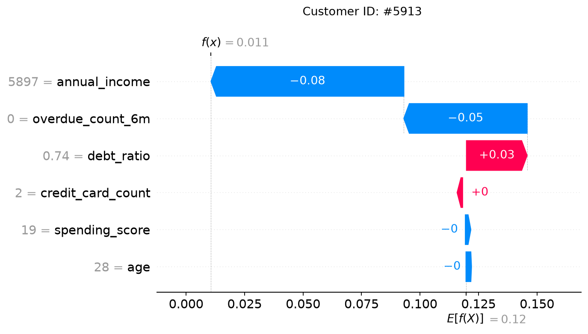

판정: **승인(저위험)**, 예측 연체 확률 **1.07%**, 관측 연체 라벨 0. 기준값 0.119657 + 기여도 합 -0.109005 = 0.010653.

| 변수 | 모델 입력값 | SHAP 기여(확률 %p) |
| --- | --- | --- |
| 나이 | 28.00 | -0.028 |
| 연 소득(만원) | 5897.00 | -8.243 |
| 소비 점수 | 19.00 | -0.118 |
| 부채비율 | 0.74 | +2.592 |
| 카드 수 | 2.00 | +0.166 |
| 최근 6개월 연체 횟수 | 0.00 | -5.270 |

주요 이유: 연 소득(만원) 5897.00가 기준 확률을 8.24%p 낮춤; 최근 6개월 연체 횟수 0.00가 기준 확률을 5.27%p 낮춤; 부채비율 0.74가 기준 확률을 2.59%p 높임.

**영업팀 설명 예시**

> 이 고객의 연체 가능성을 모델은 1.07%로 추정해 저위험으로 분류했습니다. 모델은 연 소득 5,897만원, 최근 6개월 연체 0회 정보를 위험을 낮추는 근거로 반영했습니다. 모델은 부채비율 74% 정보를 위험을 높이는 근거로 반영했습니다. 이 중 가장 크게 작용한 정보는 연 소득 5,897만원입니다. 이는 현재 입력된 정보에 대한 모델의 판단이며, 고객의 실제 상환 가능성은 추가 확인이 필요합니다.

**페르소나와 연결:** C0 ‘연령 낮은 · 소득 높은’의 관측 연체율은 1.88%이고, 이 대표 고객의 모델 추정치는 1.07%입니다. 앞의 값은 전체 군집의 관측 비율, 뒤의 값은 평가 고객 한 명의 예측이므로 같은 지표는 아닙니다. 부채비율의 위험 증가 기여와 연 소득(만원)·최근 6개월 연체 횟수의 위험 감소 기여가 함께 존재합니다. 군집의 평균적 특성만으로 이 고객의 위험을 단정하면 이런 차이를 놓칩니다.

**상담에서 확인할 내용:** 기존 거래에서 불편한 점과 원하는 혜택을 확인하고, 알림·결제 편의 등 유지 중심의 안내를 제공합니다. 낮은 연체 추정만으로 추가 대출이나 한도 확대를 권할 근거는 없으며, 상품 관심도는 따로 확인합니다.

### cluster_1: 고객 #6190 / C1

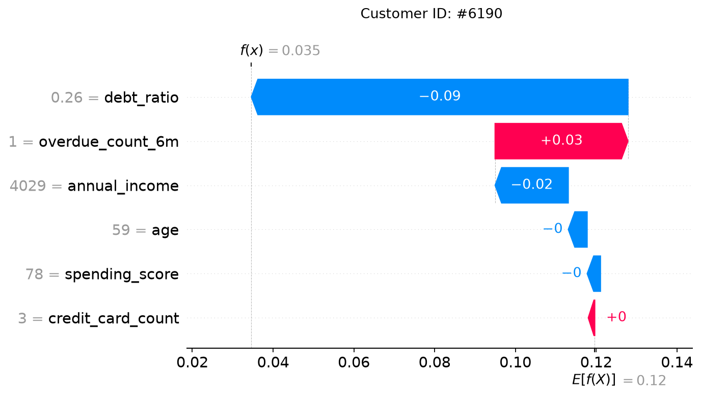

판정: **승인(저위험)**, 예측 연체 확률 **3.46%**, 관측 연체 라벨 0. 기준값 0.119657 + 기여도 합 -0.085027 = 0.034630.

| 변수 | 모델 입력값 | SHAP 기여(확률 %p) |
| --- | --- | --- |
| 나이 | 59.00 | -0.467 |
| 연 소득(만원) | 4029.00 | -1.813 |
| 소비 점수 | 78.00 | -0.330 |
| 부채비율 | 0.26 | -9.325 |
| 카드 수 | 3.00 | +0.142 |
| 최근 6개월 연체 횟수 | 1.00 | +3.290 |

주요 이유: 부채비율 0.26가 기준 확률을 9.32%p 낮춤; 최근 6개월 연체 횟수 1.00가 기준 확률을 3.29%p 높임; 연 소득(만원) 4029.00가 기준 확률을 1.81%p 낮춤.

**영업팀 설명 예시**

> 이 고객의 연체 가능성을 모델은 3.46%로 추정해 저위험으로 분류했습니다. 모델은 부채비율 26%, 연 소득 4,029만원 정보를 위험을 낮추는 근거로 반영했습니다. 모델은 최근 6개월 연체 1회 정보를 위험을 높이는 근거로 반영했습니다. 이 중 가장 크게 작용한 정보는 부채비율 26%입니다. 이는 현재 입력된 정보에 대한 모델의 판단이며, 고객의 실제 상환 가능성은 추가 확인이 필요합니다.

**페르소나와 연결:** C1 ‘연체이력 많은 · 소비점수 높은’의 관측 연체율은 21.71%이고, 이 대표 고객의 모델 추정치는 3.46%입니다. 앞의 값은 전체 군집의 관측 비율, 뒤의 값은 평가 고객 한 명의 예측이므로 같은 지표는 아닙니다. 최근 6개월 연체 횟수의 위험 증가 기여와 부채비율·연 소득(만원)의 위험 감소 기여가 함께 존재합니다. 군집의 평균적 특성만으로 이 고객의 위험을 단정하면 이런 차이를 놓칩니다.

**상담에서 확인할 내용:** 저위험 판정과 별개로 최근 연체의 발생 사유와 해소 여부를 확인합니다. “전체 위험 추정은 낮은 편이지만 최근 납부 이력이 있어, 결제일 알림이나 자동이체가 도움이 될지 확인하겠습니다”라고 안내합니다. 이 고객은 군집 단위 상담 대상 선정과 개별 판정을 분리해야 하는 사례입니다.

### cluster_2: 고객 #5917 / C2

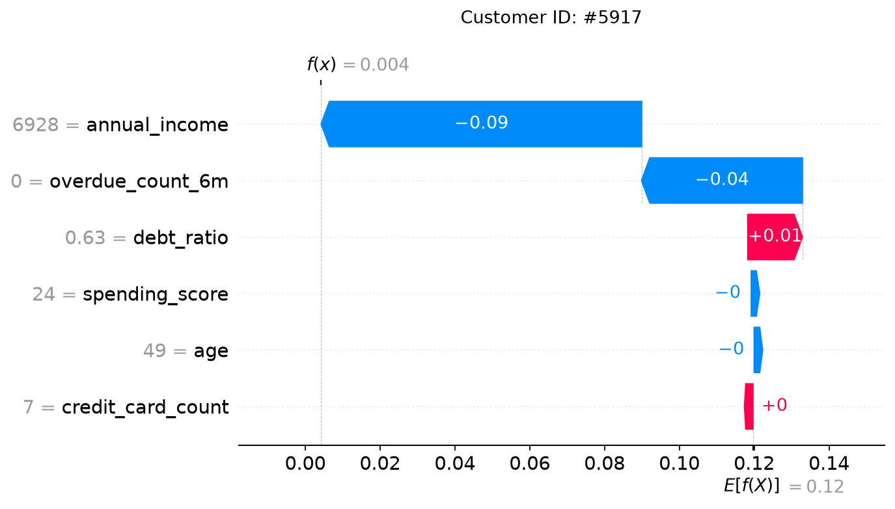

판정: **승인(저위험)**, 예측 연체 확률 **0.43%**, 관측 연체 라벨 0. 기준값 0.119657 + 기여도 합 -0.115406 = 0.004251.

| 변수 | 모델 입력값 | SHAP 기여(확률 %p) |
| --- | --- | --- |
| 나이 | 49.00 | -0.078 |
| 연 소득(만원) | 6928.00 | -8.565 |
| 소비 점수 | 24.00 | -0.092 |
| 부채비율 | 0.63 | +1.456 |
| 카드 수 | 7.00 | +0.036 |
| 최근 6개월 연체 횟수 | 0.00 | -4.298 |

주요 이유: 연 소득(만원) 6928.00가 기준 확률을 8.57%p 낮춤; 최근 6개월 연체 횟수 0.00가 기준 확률을 4.30%p 낮춤; 부채비율 0.63가 기준 확률을 1.46%p 높임.

**영업팀 설명 예시**

> 이 고객의 연체 가능성을 모델은 0.43%로 추정해 저위험으로 분류했습니다. 모델은 연 소득 6,928만원, 최근 6개월 연체 0회 정보를 위험을 낮추는 근거로 반영했습니다. 모델은 부채비율 63% 정보를 위험을 높이는 근거로 반영했습니다. 이 중 가장 크게 작용한 정보는 연 소득 6,928만원입니다. 이는 현재 입력된 정보에 대한 모델의 판단이며, 고객의 실제 상환 가능성은 추가 확인이 필요합니다.

**페르소나와 연결:** C2 ‘다카드 · 소비점수 낮은’의 관측 연체율은 3.11%이고, 이 대표 고객의 모델 추정치는 0.43%입니다. 앞의 값은 전체 군집의 관측 비율, 뒤의 값은 평가 고객 한 명의 예측이므로 같은 지표는 아닙니다. 부채비율의 위험 증가 기여와 연 소득(만원)·최근 6개월 연체 횟수의 위험 감소 기여가 함께 존재합니다. 군집의 평균적 특성만으로 이 고객의 위험을 단정하면 이런 차이를 놓칩니다.

**상담에서 확인할 내용:** 기존 거래에서 불편한 점과 원하는 혜택을 확인하고, 알림·결제 편의 등 유지 중심의 안내를 제공합니다. 낮은 연체 추정만으로 추가 대출이나 한도 확대를 권할 근거는 없으며, 상품 관심도는 따로 확인합니다.

### cluster_3: 고객 #7912 / C3

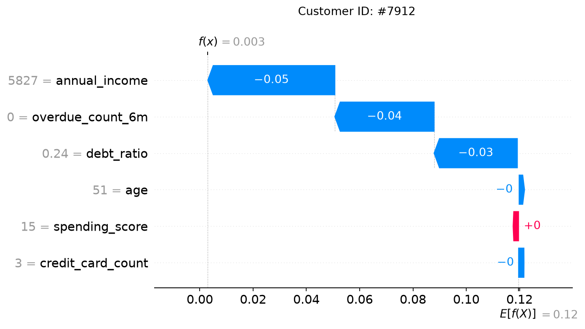

판정: **승인(저위험)**, 예측 연체 확률 **0.30%**, 관측 연체 라벨 0. 기준값 0.119657 + 기여도 합 -0.116652 = 0.003006.

| 변수 | 모델 입력값 | SHAP 기여(확률 %p) |
| --- | --- | --- |
| 나이 | 51.00 | -0.068 |
| 연 소득(만원) | 5827.00 | -4.768 |
| 소비 점수 | 15.00 | +0.023 |
| 부채비율 | 0.24 | -3.125 |
| 카드 수 | 3.00 | -0.003 |
| 최근 6개월 연체 횟수 | 0.00 | -3.725 |

주요 이유: 연 소득(만원) 5827.00가 기준 확률을 4.77%p 낮춤; 최근 6개월 연체 횟수 0.00가 기준 확률을 3.72%p 낮춤; 부채비율 0.24가 기준 확률을 3.13%p 낮춤.

**영업팀 설명 예시**

> 이 고객의 연체 가능성을 모델은 0.30%로 추정해 저위험으로 분류했습니다. 모델은 연 소득 5,827만원, 최근 6개월 연체 0회, 부채비율 24% 정보를 위험을 낮추는 근거로 반영했습니다. 이 중 가장 크게 작용한 정보는 연 소득 5,827만원입니다. 이는 현재 입력된 정보에 대한 모델의 판단이며, 고객의 실제 상환 가능성은 추가 확인이 필요합니다.

**페르소나와 연결:** C3 ‘부채비율 낮은 · 소비점수 낮은’의 관측 연체율은 0.37%이고, 이 대표 고객의 모델 추정치는 0.30%입니다. 앞의 값은 전체 군집의 관측 비율, 뒤의 값은 평가 고객 한 명의 예측이므로 같은 지표는 아닙니다. 대표 고객의 주요 기여 방향을 확인한 뒤 안내하며, 같은 군집의 나머지 고객에게 이 판정을 일괄 적용하지 않습니다.

**상담에서 확인할 내용:** 기존 거래에서 불편한 점과 원하는 혜택을 확인하고, 알림·결제 편의 등 유지 중심의 안내를 제공합니다. 낮은 연체 추정만으로 추가 대출이나 한도 확대를 권할 근거는 없으며, 상품 관심도는 따로 확인합니다.

### cluster_4: 고객 #7368 / C4

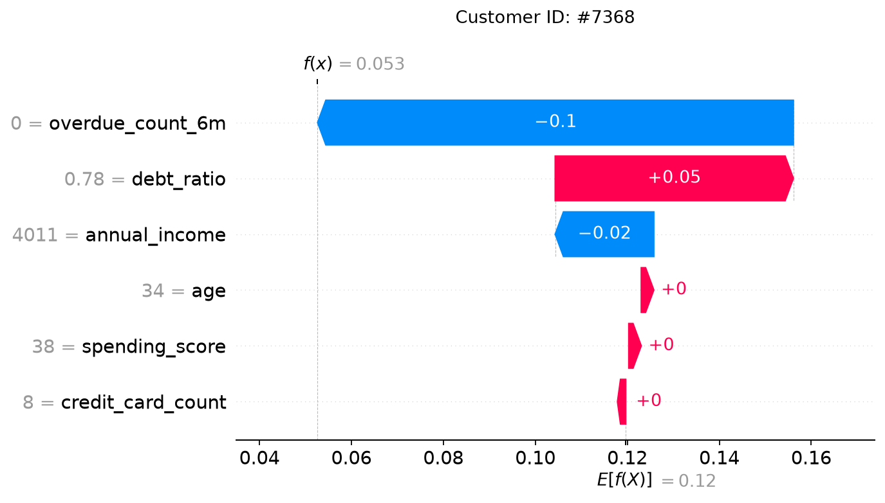

판정: **승인(저위험)**, 예측 연체 확률 **5.26%**, 관측 연체 라벨 1. 기준값 0.119657 + 기여도 합 -0.067008 = 0.052650.

| 변수 | 모델 입력값 | SHAP 기여(확률 %p) |
| --- | --- | --- |
| 나이 | 34.00 | +0.273 |
| 연 소득(만원) | 4011.00 | -2.145 |
| 소비 점수 | 38.00 | +0.272 |
| 부채비율 | 0.78 | +5.180 |
| 카드 수 | 8.00 | +0.066 |
| 최근 6개월 연체 횟수 | 0.00 | -10.347 |

주요 이유: 최근 6개월 연체 횟수 0.00가 기준 확률을 10.35%p 낮춤; 부채비율 0.78가 기준 확률을 5.18%p 높임; 연 소득(만원) 4011.00가 기준 확률을 2.14%p 낮춤.

**영업팀 설명 예시**

> 이 고객의 연체 가능성을 모델은 5.26%로 추정해 저위험으로 분류했습니다. 모델은 최근 6개월 연체 0회, 연 소득 4,011만원 정보를 위험을 낮추는 근거로 반영했습니다. 모델은 부채비율 78% 정보를 위험을 높이는 근거로 반영했습니다. 이 중 가장 크게 작용한 정보는 최근 6개월 연체 0회입니다. 이는 현재 입력된 정보에 대한 모델의 판단이며, 고객의 실제 상환 가능성은 추가 확인이 필요합니다.

**페르소나와 연결:** C4 ‘연령 낮은 · 부채비율 높은’의 관측 연체율은 26.14%이고, 이 대표 고객의 모델 추정치는 5.26%입니다. 앞의 값은 전체 군집의 관측 비율, 뒤의 값은 평가 고객 한 명의 예측이므로 같은 지표는 아닙니다. 부채비율의 위험 증가 기여와 최근 6개월 연체 횟수·연 소득(만원)의 위험 감소 기여가 함께 존재합니다. 군집의 평균적 특성만으로 이 고객의 위험을 단정하면 이런 차이를 놓칩니다.

**상담에서 확인할 내용:** 기존 거래에서 불편한 점과 원하는 혜택을 확인하고, 알림·결제 편의 등 유지 중심의 안내를 제공합니다. 낮은 연체 추정만으로 추가 대출이나 한도 확대를 권할 근거는 없으며, 상품 관심도는 따로 확인합니다.

### cluster_5: 고객 #3806 / C5

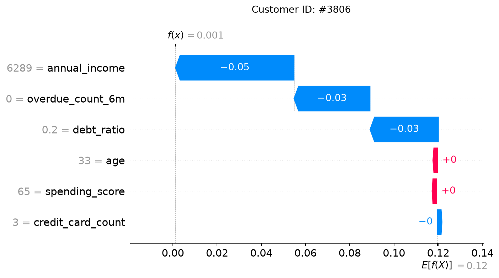

판정: **승인(저위험)**, 예측 연체 확률 **0.12%**, 관측 연체 라벨 0. 기준값 0.119657 + 기여도 합 -0.118451 = 0.001206.

| 변수 | 모델 입력값 | SHAP 기여(확률 %p) |
| --- | --- | --- |
| 나이 | 33.00 | +0.043 |
| 연 소득(만원) | 6289.00 | -5.358 |
| 소비 점수 | 65.00 | +0.039 |
| 부채비율 | 0.20 | -3.094 |
| 카드 수 | 3.00 | -0.039 |
| 최근 6개월 연체 횟수 | 0.00 | -3.437 |

주요 이유: 연 소득(만원) 6289.00가 기준 확률을 5.36%p 낮춤; 최근 6개월 연체 횟수 0.00가 기준 확률을 3.44%p 낮춤; 부채비율 0.20가 기준 확률을 3.09%p 낮춤.

**영업팀 설명 예시**

> 이 고객의 연체 가능성을 모델은 0.12%로 추정해 저위험으로 분류했습니다. 모델은 연 소득 6,289만원, 최근 6개월 연체 0회, 부채비율 20% 정보를 위험을 낮추는 근거로 반영했습니다. 이 중 가장 크게 작용한 정보는 연 소득 6,289만원입니다. 이는 현재 입력된 정보에 대한 모델의 판단이며, 고객의 실제 상환 가능성은 추가 확인이 필요합니다.

**페르소나와 연결:** C5 ‘소비점수 높은 · 부채비율 낮은’의 관측 연체율은 0.18%이고, 이 대표 고객의 모델 추정치는 0.12%입니다. 앞의 값은 전체 군집의 관측 비율, 뒤의 값은 평가 고객 한 명의 예측이므로 같은 지표는 아닙니다. 대표 고객의 주요 기여 방향을 확인한 뒤 안내하며, 같은 군집의 나머지 고객에게 이 판정을 일괄 적용하지 않습니다.

**상담에서 확인할 내용:** 기존 거래에서 불편한 점과 원하는 혜택을 확인하고, 알림·결제 편의 등 유지 중심의 안내를 제공합니다. 낮은 연체 추정만으로 추가 대출이나 한도 확대를 권할 근거는 없으며, 상품 관심도는 따로 확인합니다.

### cluster_6: 고객 #274 / C6

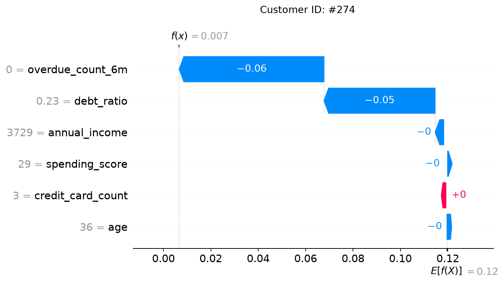

판정: **승인(저위험)**, 예측 연체 확률 **0.66%**, 관측 연체 라벨 0. 기준값 0.119657 + 기여도 합 -0.113019 = 0.006638.

| 변수 | 모델 입력값 | SHAP 기여(확률 %p) |
| --- | --- | --- |
| 나이 | 36.00 | -0.046 |
| 연 소득(만원) | 3729.00 | -0.363 |
| 소비 점수 | 29.00 | -0.164 |
| 부채비율 | 0.23 | -4.690 |
| 카드 수 | 3.00 | +0.071 |
| 최근 6개월 연체 횟수 | 0.00 | -6.110 |

주요 이유: 최근 6개월 연체 횟수 0.00가 기준 확률을 6.11%p 낮춤; 부채비율 0.23가 기준 확률을 4.69%p 낮춤; 연 소득(만원) 3729.00가 기준 확률을 0.36%p 낮춤.

**영업팀 설명 예시**

> 이 고객의 연체 가능성을 모델은 0.66%로 추정해 저위험으로 분류했습니다. 모델은 최근 6개월 연체 0회, 부채비율 23%, 연 소득 3,729만원 정보를 위험을 낮추는 근거로 반영했습니다. 이 중 가장 크게 작용한 정보는 최근 6개월 연체 0회입니다. 이는 현재 입력된 정보에 대한 모델의 판단이며, 고객의 실제 상환 가능성은 추가 확인이 필요합니다.

**페르소나와 연결:** C6 ‘소수카드 · 소득 낮은’의 관측 연체율은 10.06%이고, 이 대표 고객의 모델 추정치는 0.66%입니다. 앞의 값은 전체 군집의 관측 비율, 뒤의 값은 평가 고객 한 명의 예측이므로 같은 지표는 아닙니다. 대표 고객의 주요 기여 방향을 확인한 뒤 안내하며, 같은 군집의 나머지 고객에게 이 판정을 일괄 적용하지 않습니다.

**상담에서 확인할 내용:** 기존 거래에서 불편한 점과 원하는 혜택을 확인하고, 알림·결제 편의 등 유지 중심의 안내를 제공합니다. 낮은 연체 추정만으로 추가 대출이나 한도 확대를 권할 근거는 없으며, 상품 관심도는 따로 확인합니다.

### cluster_7: 고객 #1490 / C7

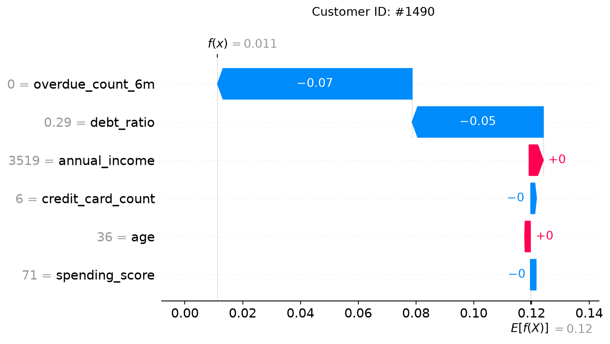

판정: **승인(저위험)**, 예측 연체 확률 **1.13%**, 관측 연체 라벨 0. 기준값 0.119657 + 기여도 합 -0.108367 = 0.011290.

| 변수 | 모델 입력값 | SHAP 기여(확률 %p) |
| --- | --- | --- |
| 나이 | 36.00 | +0.015 |
| 연 소득(만원) | 3519.00 | +0.490 |
| 소비 점수 | 71.00 | -0.003 |
| 부채비율 | 0.29 | -4.541 |
| 카드 수 | 6.00 | -0.058 |
| 최근 6개월 연체 횟수 | 0.00 | -6.740 |

주요 이유: 최근 6개월 연체 횟수 0.00가 기준 확률을 6.74%p 낮춤; 부채비율 0.29가 기준 확률을 4.54%p 낮춤; 연 소득(만원) 3519.00가 기준 확률을 0.49%p 높임.

**영업팀 설명 예시**

> 이 고객의 연체 가능성을 모델은 1.13%로 추정해 저위험으로 분류했습니다. 모델은 최근 6개월 연체 0회, 부채비율 29% 정보를 위험을 낮추는 근거로 반영했습니다. 모델은 연 소득 3,519만원 정보를 위험을 높이는 근거로 반영했습니다. 이 중 가장 크게 작용한 정보는 최근 6개월 연체 0회입니다. 이는 현재 입력된 정보에 대한 모델의 판단이며, 고객의 실제 상환 가능성은 추가 확인이 필요합니다.

**페르소나와 연결:** C7 ‘부채비율 낮은 · 소비점수 높은’의 관측 연체율은 10.02%이고, 이 대표 고객의 모델 추정치는 1.13%입니다. 앞의 값은 전체 군집의 관측 비율, 뒤의 값은 평가 고객 한 명의 예측이므로 같은 지표는 아닙니다. 연 소득(만원)의 위험 증가 기여와 최근 6개월 연체 횟수·부채비율의 위험 감소 기여가 함께 존재합니다. 군집의 평균적 특성만으로 이 고객의 위험을 단정하면 이런 차이를 놓칩니다.

**상담에서 확인할 내용:** 기존 거래에서 불편한 점과 원하는 혜택을 확인하고, 알림·결제 편의 등 유지 중심의 안내를 제공합니다. 낮은 연체 추정만으로 추가 대출이나 한도 확대를 권할 근거는 없으며, 상품 관심도는 따로 확인합니다.

### cluster_8: 고객 #8703 / C8

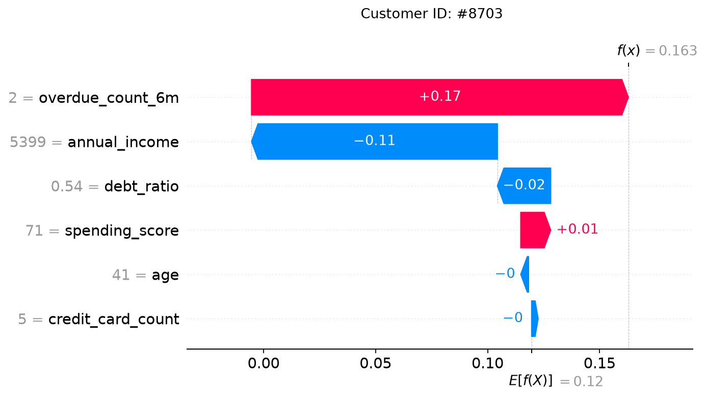

판정: **승인(저위험)**, 예측 연체 확률 **16.28%**, 관측 연체 라벨 1. 기준값 0.119657 + 기여도 합 +0.043169 = 0.162826.

| 변수 | 모델 입력값 | SHAP 기여(확률 %p) |
| --- | --- | --- |
| 나이 | 41.00 | -0.348 |
| 연 소득(만원) | 5399.00 | -10.976 |
| 소비 점수 | 71.00 | +1.335 |
| 부채비율 | 0.54 | -2.377 |
| 카드 수 | 5.00 | -0.137 |
| 최근 6개월 연체 횟수 | 2.00 | +16.820 |

주요 이유: 최근 6개월 연체 횟수 2.00가 기준 확률을 16.82%p 높임; 연 소득(만원) 5399.00가 기준 확률을 10.98%p 낮춤; 부채비율 0.54가 기준 확률을 2.38%p 낮춤.

**영업팀 설명 예시**

> 이 고객의 연체 가능성을 모델은 16.28%로 추정해 저위험으로 분류했습니다. 모델은 연 소득 5,399만원, 부채비율 54% 정보를 위험을 낮추는 근거로 반영했습니다. 모델은 최근 6개월 연체 2회 정보를 위험을 높이는 근거로 반영했습니다. 이 중 가장 크게 작용한 정보는 최근 6개월 연체 2회입니다. 이는 현재 입력된 정보에 대한 모델의 판단이며, 고객의 실제 상환 가능성은 추가 확인이 필요합니다.

**페르소나와 연결:** C8 ‘연체이력 많은 · 소비점수 높은’의 관측 연체율은 30.00%이고, 이 대표 고객의 모델 추정치는 16.28%입니다. 앞의 값은 전체 군집의 관측 비율, 뒤의 값은 평가 고객 한 명의 예측이므로 같은 지표는 아닙니다. 최근 6개월 연체 횟수의 위험 증가 기여와 연 소득(만원)·부채비율의 위험 감소 기여가 함께 존재합니다. 군집의 평균적 특성만으로 이 고객의 위험을 단정하면 이런 차이를 놓칩니다.

**상담에서 확인할 내용:** 저위험 판정과 별개로 최근 연체의 발생 사유와 해소 여부를 확인합니다. “전체 위험 추정은 낮은 편이지만 최근 납부 이력이 있어, 결제일 알림이나 자동이체가 도움이 될지 확인하겠습니다”라고 안내합니다. 이 고객은 군집 단위 상담 대상 선정과 개별 판정을 분리해야 하는 사례입니다.

### cluster_9: 고객 #3043 / C9

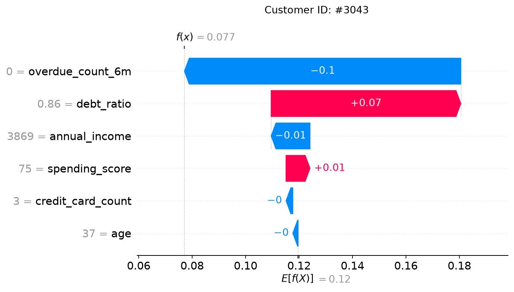

판정: **승인(저위험)**, 예측 연체 확률 **7.71%**, 관측 연체 라벨 0. 기준값 0.119657 + 기여도 합 -0.042528 = 0.077130.

| 변수 | 모델 입력값 | SHAP 기여(확률 %p) |
| --- | --- | --- |
| 나이 | 37.00 | -0.198 |
| 연 소득(만원) | 3869.00 | -1.452 |
| 소비 점수 | 75.00 | +0.896 |
| 부채비율 | 0.86 | +7.095 |
| 카드 수 | 3.00 | -0.254 |
| 최근 6개월 연체 횟수 | 0.00 | -10.339 |

주요 이유: 최근 6개월 연체 횟수 0.00가 기준 확률을 10.34%p 낮춤; 부채비율 0.86가 기준 확률을 7.09%p 높임; 연 소득(만원) 3869.00가 기준 확률을 1.45%p 낮춤.

**영업팀 설명 예시**

> 이 고객의 연체 가능성을 모델은 7.71%로 추정해 저위험으로 분류했습니다. 모델은 최근 6개월 연체 0회, 연 소득 3,869만원 정보를 위험을 낮추는 근거로 반영했습니다. 모델은 부채비율 86% 정보를 위험을 높이는 근거로 반영했습니다. 이 중 가장 크게 작용한 정보는 최근 6개월 연체 0회입니다. 이는 현재 입력된 정보에 대한 모델의 판단이며, 고객의 실제 상환 가능성은 추가 확인이 필요합니다.

**페르소나와 연결:** C9 ‘부채비율 높은 · 소수카드’의 관측 연체율은 24.45%이고, 이 대표 고객의 모델 추정치는 7.71%입니다. 앞의 값은 전체 군집의 관측 비율, 뒤의 값은 평가 고객 한 명의 예측이므로 같은 지표는 아닙니다. 부채비율의 위험 증가 기여와 최근 6개월 연체 횟수·연 소득(만원)의 위험 감소 기여가 함께 존재합니다. 군집의 평균적 특성만으로 이 고객의 위험을 단정하면 이런 차이를 놓칩니다.

**상담에서 확인할 내용:** 기존 거래에서 불편한 점과 원하는 혜택을 확인하고, 알림·결제 편의 등 유지 중심의 안내를 제공합니다. 낮은 연체 추정만으로 추가 대출이나 한도 확대를 권할 근거는 없으며, 상품 관심도는 따로 확인합니다.

### cluster_10: 고객 #4939 / C10

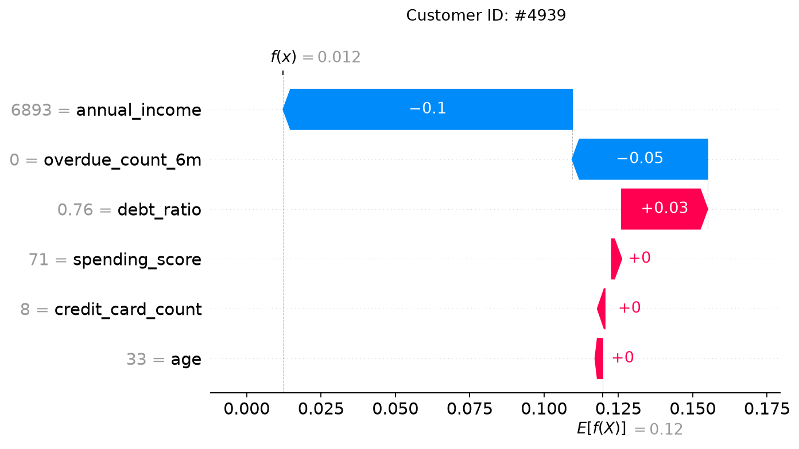

판정: **승인(저위험)**, 예측 연체 확률 **1.23%**, 관측 연체 라벨 0. 기준값 0.119657 + 기여도 합 -0.107354 = 0.012303.

| 변수 | 모델 입력값 | SHAP 기여(확률 %p) |
| --- | --- | --- |
| 나이 | 33.00 | +0.079 |
| 연 소득(만원) | 6893.00 | -9.716 |
| 소비 점수 | 71.00 | +0.335 |
| 부채비율 | 0.76 | +2.888 |
| 카드 수 | 8.00 | +0.231 |
| 최근 6개월 연체 횟수 | 0.00 | -4.552 |

주요 이유: 연 소득(만원) 6893.00가 기준 확률을 9.72%p 낮춤; 최근 6개월 연체 횟수 0.00가 기준 확률을 4.55%p 낮춤; 부채비율 0.76가 기준 확률을 2.89%p 높임.

**영업팀 설명 예시**

> 이 고객의 연체 가능성을 모델은 1.23%로 추정해 저위험으로 분류했습니다. 모델은 연 소득 6,893만원, 최근 6개월 연체 0회 정보를 위험을 낮추는 근거로 반영했습니다. 모델은 부채비율 76% 정보를 위험을 높이는 근거로 반영했습니다. 이 중 가장 크게 작용한 정보는 연 소득 6,893만원입니다. 이는 현재 입력된 정보에 대한 모델의 판단이며, 고객의 실제 상환 가능성은 추가 확인이 필요합니다.

**페르소나와 연결:** C10 ‘연령 낮은 · 부채비율 높은’의 관측 연체율은 1.78%이고, 이 대표 고객의 모델 추정치는 1.23%입니다. 앞의 값은 전체 군집의 관측 비율, 뒤의 값은 평가 고객 한 명의 예측이므로 같은 지표는 아닙니다. 부채비율의 위험 증가 기여와 연 소득(만원)·최근 6개월 연체 횟수의 위험 감소 기여가 함께 존재합니다. 군집의 평균적 특성만으로 이 고객의 위험을 단정하면 이런 차이를 놓칩니다.

**상담에서 확인할 내용:** 기존 거래에서 불편한 점과 원하는 혜택을 확인하고, 알림·결제 편의 등 유지 중심의 안내를 제공합니다. 낮은 연체 추정만으로 추가 대출이나 한도 확대를 권할 근거는 없으며, 상품 관심도는 따로 확인합니다.

### cluster_11: 고객 #7767 / C11

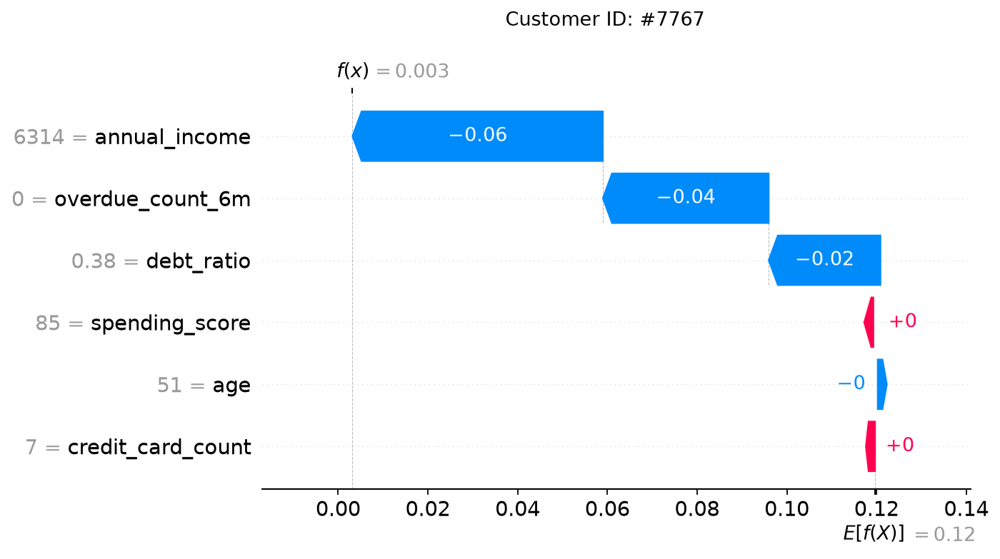

판정: **승인(저위험)**, 예측 연체 확률 **0.32%**, 관측 연체 라벨 0. 기준값 0.119657 + 기여도 합 -0.116460 = 0.003198.

| 변수 | 모델 입력값 | SHAP 기여(확률 %p) |
| --- | --- | --- |
| 나이 | 51.00 | -0.098 |
| 연 소득(만원) | 6314.00 | -5.580 |
| 소비 점수 | 85.00 | +0.159 |
| 부채비율 | 0.38 | -2.490 |
| 카드 수 | 7.00 | +0.060 |
| 최근 6개월 연체 횟수 | 0.00 | -3.696 |

주요 이유: 연 소득(만원) 6314.00가 기준 확률을 5.58%p 낮춤; 최근 6개월 연체 횟수 0.00가 기준 확률을 3.70%p 낮춤; 부채비율 0.38가 기준 확률을 2.49%p 낮춤.

**영업팀 설명 예시**

> 이 고객의 연체 가능성을 모델은 0.32%로 추정해 저위험으로 분류했습니다. 모델은 연 소득 6,314만원, 최근 6개월 연체 0회, 부채비율 38% 정보를 위험을 낮추는 근거로 반영했습니다. 이 중 가장 크게 작용한 정보는 연 소득 6,314만원입니다. 이는 현재 입력된 정보에 대한 모델의 판단이며, 고객의 실제 상환 가능성은 추가 확인이 필요합니다.

**페르소나와 연결:** C11 ‘다카드 · 소비점수 높은’의 관측 연체율은 0.00%이고, 이 대표 고객의 모델 추정치는 0.32%입니다. 앞의 값은 전체 군집의 관측 비율, 뒤의 값은 평가 고객 한 명의 예측이므로 같은 지표는 아닙니다. 대표 고객의 주요 기여 방향을 확인한 뒤 안내하며, 같은 군집의 나머지 고객에게 이 판정을 일괄 적용하지 않습니다.

**상담에서 확인할 내용:** 기존 거래에서 불편한 점과 원하는 혜택을 확인하고, 알림·결제 편의 등 유지 중심의 안내를 제공합니다. 낮은 연체 추정만으로 추가 대출이나 한도 확대를 권할 근거는 없으며, 상품 관심도는 따로 확인합니다.

### cluster_12: 고객 #1580 / C12

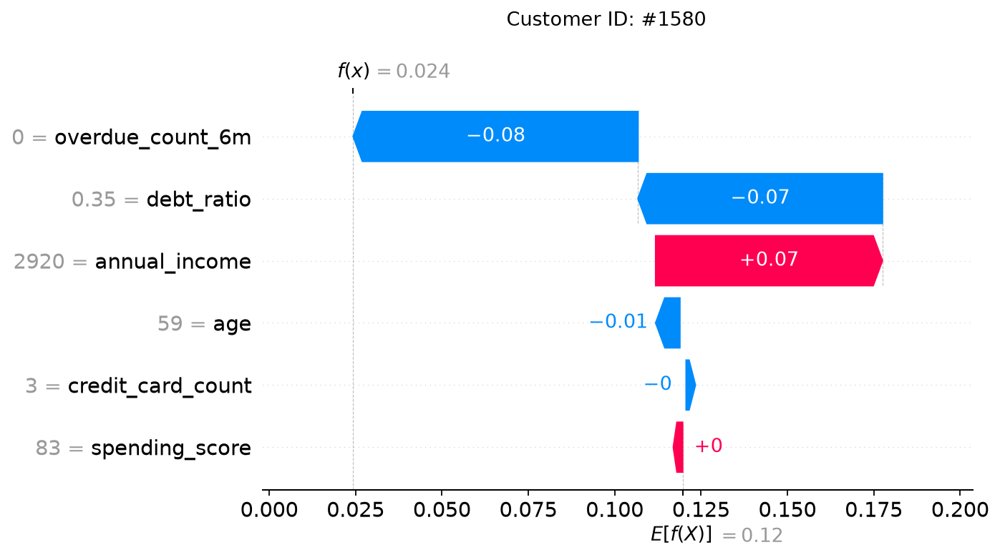

판정: **승인(저위험)**, 예측 연체 확률 **2.43%**, 관측 연체 라벨 0. 기준값 0.119657 + 기여도 합 -0.095336 = 0.024321.

| 변수 | 모델 입력값 | SHAP 기여(확률 %p) |
| --- | --- | --- |
| 나이 | 59.00 | -0.698 |
| 연 소득(만원) | 2920.00 | +6.560 |
| 소비 점수 | 83.00 | +0.105 |
| 부채비율 | 0.35 | -7.074 |
| 카드 수 | 3.00 | -0.184 |
| 최근 6개월 연체 횟수 | 0.00 | -8.243 |

주요 이유: 최근 6개월 연체 횟수 0.00가 기준 확률을 8.24%p 낮춤; 부채비율 0.35가 기준 확률을 7.07%p 낮춤; 연 소득(만원) 2920.00가 기준 확률을 6.56%p 높임.

**영업팀 설명 예시**

> 이 고객의 연체 가능성을 모델은 2.43%로 추정해 저위험으로 분류했습니다. 모델은 최근 6개월 연체 0회, 부채비율 35% 정보를 위험을 낮추는 근거로 반영했습니다. 모델은 연 소득 2,920만원 정보를 위험을 높이는 근거로 반영했습니다. 이 중 가장 크게 작용한 정보는 최근 6개월 연체 0회입니다. 이는 현재 입력된 정보에 대한 모델의 판단이며, 고객의 실제 상환 가능성은 추가 확인이 필요합니다.

**페르소나와 연결:** C12 ‘연령 높은 · 소비점수 높은’의 관측 연체율은 1.49%이고, 이 대표 고객의 모델 추정치는 2.43%입니다. 앞의 값은 전체 군집의 관측 비율, 뒤의 값은 평가 고객 한 명의 예측이므로 같은 지표는 아닙니다. 연 소득(만원)의 위험 증가 기여와 최근 6개월 연체 횟수·부채비율의 위험 감소 기여가 함께 존재합니다. 군집의 평균적 특성만으로 이 고객의 위험을 단정하면 이런 차이를 놓칩니다.

**상담에서 확인할 내용:** 기존 거래에서 불편한 점과 원하는 혜택을 확인하고, 알림·결제 편의 등 유지 중심의 안내를 제공합니다. 낮은 연체 추정만으로 추가 대출이나 한도 확대를 권할 근거는 없으며, 상품 관심도는 따로 확인합니다.

### cluster_13: 고객 #4130 / C13

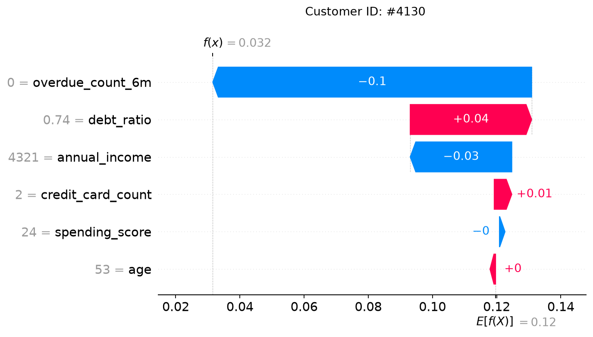

판정: **승인(저위험)**, 예측 연체 확률 **3.16%**, 관측 연체 라벨 0. 기준값 0.119657 + 기여도 합 -0.088106 = 0.031551.

| 변수 | 모델 입력값 | SHAP 기여(확률 %p) |
| --- | --- | --- |
| 나이 | 53.00 | +0.123 |
| 연 소득(만원) | 4321.00 | -3.163 |
| 소비 점수 | 24.00 | -0.163 |
| 부채비율 | 0.74 | +3.782 |
| 카드 수 | 2.00 | +0.546 |
| 최근 6개월 연체 횟수 | 0.00 | -9.934 |

주요 이유: 최근 6개월 연체 횟수 0.00가 기준 확률을 9.93%p 낮춤; 부채비율 0.74가 기준 확률을 3.78%p 높임; 연 소득(만원) 4321.00가 기준 확률을 3.16%p 낮춤.

**영업팀 설명 예시**

> 이 고객의 연체 가능성을 모델은 3.16%로 추정해 저위험으로 분류했습니다. 모델은 최근 6개월 연체 0회, 연 소득 4,321만원 정보를 위험을 낮추는 근거로 반영했습니다. 모델은 부채비율 74% 정보를 위험을 높이는 근거로 반영했습니다. 이 중 가장 크게 작용한 정보는 최근 6개월 연체 0회입니다. 이는 현재 입력된 정보에 대한 모델의 판단이며, 고객의 실제 상환 가능성은 추가 확인이 필요합니다.

**페르소나와 연결:** C13 ‘소비점수 낮은 · 소수카드’의 관측 연체율은 23.25%이고, 이 대표 고객의 모델 추정치는 3.16%입니다. 앞의 값은 전체 군집의 관측 비율, 뒤의 값은 평가 고객 한 명의 예측이므로 같은 지표는 아닙니다. 부채비율의 위험 증가 기여와 최근 6개월 연체 횟수·연 소득(만원)의 위험 감소 기여가 함께 존재합니다. 군집의 평균적 특성만으로 이 고객의 위험을 단정하면 이런 차이를 놓칩니다.

**상담에서 확인할 내용:** 기존 거래에서 불편한 점과 원하는 혜택을 확인하고, 알림·결제 편의 등 유지 중심의 안내를 제공합니다. 낮은 연체 추정만으로 추가 대출이나 한도 확대를 권할 근거는 없으며, 상품 관심도는 따로 확인합니다.

### cluster_14: 고객 #6858 / C14

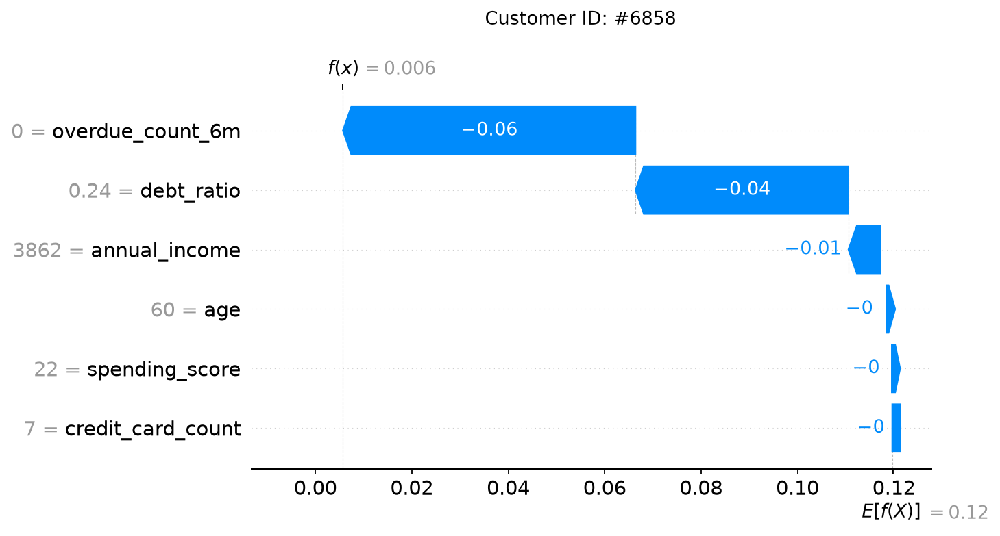

판정: **승인(저위험)**, 예측 연체 확률 **0.57%**, 관측 연체 라벨 0. 기준값 0.119657 + 기여도 합 -0.113955 = 0.005702.

| 변수 | 모델 입력값 | SHAP 기여(확률 %p) |
| --- | --- | --- |
| 나이 | 60.00 | -0.138 |
| 연 소득(만원) | 3862.00 | -0.659 |
| 소비 점수 | 22.00 | -0.103 |
| 부채비율 | 0.24 | -4.417 |
| 카드 수 | 7.00 | -0.009 |
| 최근 6개월 연체 횟수 | 0.00 | -6.069 |

주요 이유: 최근 6개월 연체 횟수 0.00가 기준 확률을 6.07%p 낮춤; 부채비율 0.24가 기준 확률을 4.42%p 낮춤; 연 소득(만원) 3862.00가 기준 확률을 0.66%p 낮춤.

**영업팀 설명 예시**

> 이 고객의 연체 가능성을 모델은 0.57%로 추정해 저위험으로 분류했습니다. 모델은 최근 6개월 연체 0회, 부채비율 24%, 연 소득 3,862만원 정보를 위험을 낮추는 근거로 반영했습니다. 이 중 가장 크게 작용한 정보는 최근 6개월 연체 0회입니다. 이는 현재 입력된 정보에 대한 모델의 판단이며, 고객의 실제 상환 가능성은 추가 확인이 필요합니다.

**페르소나와 연결:** C14 ‘다카드 · 부채비율 낮은’의 관측 연체율은 6.43%이고, 이 대표 고객의 모델 추정치는 0.57%입니다. 앞의 값은 전체 군집의 관측 비율, 뒤의 값은 평가 고객 한 명의 예측이므로 같은 지표는 아닙니다. 대표 고객의 주요 기여 방향을 확인한 뒤 안내하며, 같은 군집의 나머지 고객에게 이 판정을 일괄 적용하지 않습니다.

**상담에서 확인할 내용:** 기존 거래에서 불편한 점과 원하는 혜택을 확인하고, 알림·결제 편의 등 유지 중심의 안내를 제공합니다. 낮은 연체 추정만으로 추가 대출이나 한도 확대를 권할 근거는 없으며, 상품 관심도는 따로 확인합니다.

### cluster_15: 고객 #3959 / C15

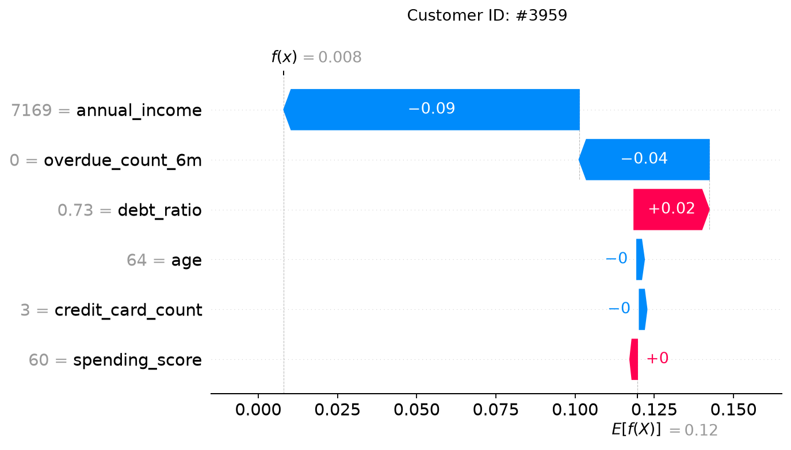

판정: **승인(저위험)**, 예측 연체 확률 **0.81%**, 관측 연체 라벨 0. 기준값 0.119657 + 기여도 합 -0.111559 = 0.008098.

| 변수 | 모델 입력값 | SHAP 기여(확률 %p) |
| --- | --- | --- |
| 나이 | 64.00 | -0.089 |
| 연 소득(만원) | 7169.00 | -9.319 |
| 소비 점수 | 60.00 | +0.068 |
| 부채비율 | 0.73 | +2.367 |
| 카드 수 | 3.00 | -0.081 |
| 최근 6개월 연체 횟수 | 0.00 | -4.102 |

주요 이유: 연 소득(만원) 7169.00가 기준 확률을 9.32%p 낮춤; 최근 6개월 연체 횟수 0.00가 기준 확률을 4.10%p 낮춤; 부채비율 0.73가 기준 확률을 2.37%p 높임.

**영업팀 설명 예시**

> 이 고객의 연체 가능성을 모델은 0.81%로 추정해 저위험으로 분류했습니다. 모델은 연 소득 7,169만원, 최근 6개월 연체 0회 정보를 위험을 낮추는 근거로 반영했습니다. 모델은 부채비율 73% 정보를 위험을 높이는 근거로 반영했습니다. 이 중 가장 크게 작용한 정보는 연 소득 7,169만원입니다. 이는 현재 입력된 정보에 대한 모델의 판단이며, 고객의 실제 상환 가능성은 추가 확인이 필요합니다.

**페르소나와 연결:** C15 ‘소득 높은 · 연령 높은’의 관측 연체율은 2.49%이고, 이 대표 고객의 모델 추정치는 0.81%입니다. 앞의 값은 전체 군집의 관측 비율, 뒤의 값은 평가 고객 한 명의 예측이므로 같은 지표는 아닙니다. 부채비율의 위험 증가 기여와 연 소득(만원)·최근 6개월 연체 횟수의 위험 감소 기여가 함께 존재합니다. 군집의 평균적 특성만으로 이 고객의 위험을 단정하면 이런 차이를 놓칩니다.

**상담에서 확인할 내용:** 기존 거래에서 불편한 점과 원하는 혜택을 확인하고, 알림·결제 편의 등 유지 중심의 안내를 제공합니다. 낮은 연체 추정만으로 추가 대출이나 한도 확대를 권할 근거는 없으며, 상품 관심도는 따로 확인합니다.

### cluster_16: 고객 #5778 / C16

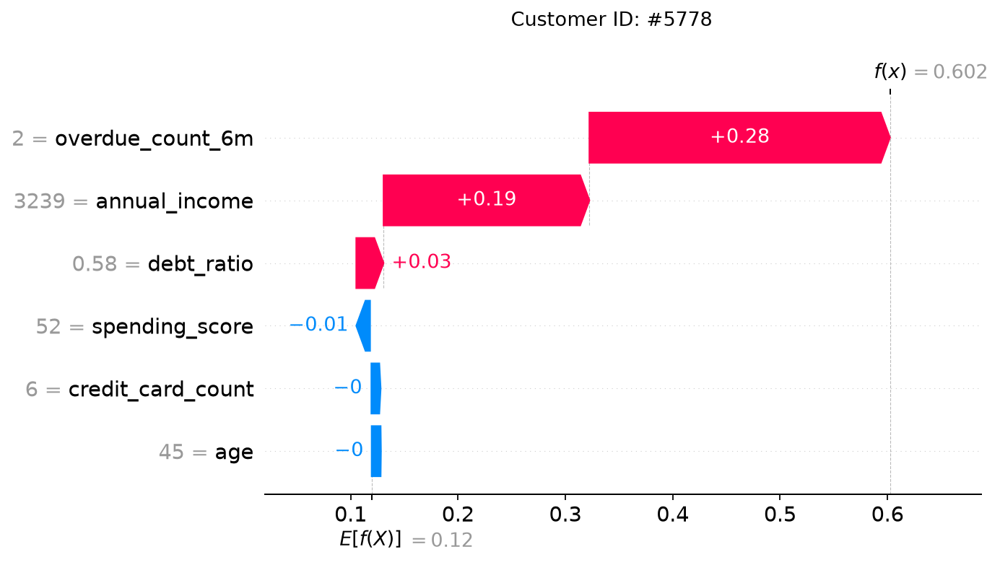

판정: **거절(고위험)**, 예측 연체 확률 **60.24%**, 관측 연체 라벨 0. 기준값 0.119657 + 기여도 합 +0.482716 = 0.602374.

| 변수 | 모델 입력값 | SHAP 기여(확률 %p) |
| --- | --- | --- |
| 나이 | 45.00 | -0.028 |
| 연 소득(만원) | 3239.00 | +19.171 |
| 소비 점수 | 52.00 | -1.282 |
| 부채비율 | 0.58 | +2.541 |
| 카드 수 | 6.00 | -0.124 |
| 최근 6개월 연체 횟수 | 2.00 | +27.994 |

주요 이유: 최근 6개월 연체 횟수 2.00가 기준 확률을 27.99%p 높임; 연 소득(만원) 3239.00가 기준 확률을 19.17%p 높임; 부채비율 0.58가 기준 확률을 2.54%p 높임.

**영업팀 설명 예시**

> 이 고객의 연체 가능성을 모델은 60.24%로 추정해 고위험으로 분류했습니다. 모델은 최근 6개월 연체 2회, 연 소득 3,239만원, 부채비율 58% 정보를 위험을 높이는 근거로 반영했습니다. 이 중 가장 크게 작용한 정보는 최근 6개월 연체 2회입니다. 이는 현재 입력된 정보에 대한 모델의 판단이며, 고객의 실제 상환 가능성은 추가 확인이 필요합니다.

**페르소나와 연결:** C16 ‘연체이력 많은 · 부채비율 높은’의 관측 연체율은 71.31%이고, 이 대표 고객의 모델 추정치는 60.24%입니다. 앞의 값은 전체 군집의 관측 비율, 뒤의 값은 평가 고객 한 명의 예측이므로 같은 지표는 아닙니다. 대표 고객의 주요 기여 방향을 확인한 뒤 안내하며, 같은 군집의 나머지 고객에게 이 판정을 일괄 적용하지 않습니다.

**상담에서 확인할 내용:** 최근 연체의 발생 시점과 해소 여부, 소득 정보의 최신성, 현재 상환 일정과 부담을 먼저 확인합니다. “상환 일정 중 부담되는 구간을 함께 점검하겠습니다”라는 안내로 상담을 시작하고, 입력 오류나 상황 변화가 확인되면 정보를 정정한 뒤 재평가합니다.

### cluster_17: 고객 #6044 / C17

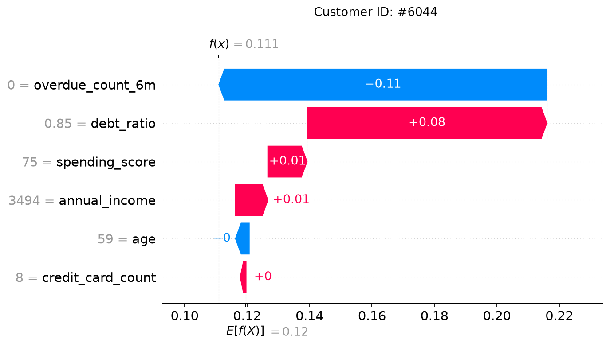

판정: **승인(저위험)**, 예측 연체 확률 **11.10%**, 관측 연체 라벨 0. 기준값 0.119657 + 기여도 합 -0.008667 = 0.110991.

| 변수 | 모델 입력값 | SHAP 기여(확률 %p) |
| --- | --- | --- |
| 나이 | 59.00 | -0.437 |
| 연 소득(만원) | 3494.00 | +1.037 |
| 소비 점수 | 75.00 | +1.254 |
| 부채비율 | 0.85 | +7.679 |
| 카드 수 | 8.00 | +0.102 |
| 최근 6개월 연체 횟수 | 0.00 | -10.502 |

주요 이유: 최근 6개월 연체 횟수 0.00가 기준 확률을 10.50%p 낮춤; 부채비율 0.85가 기준 확률을 7.68%p 높임; 소비 점수 75.00가 기준 확률을 1.25%p 높임.

**영업팀 설명 예시**

> 이 고객의 연체 가능성을 모델은 11.10%로 추정해 저위험으로 분류했습니다. 모델은 최근 6개월 연체 0회 정보를 위험을 낮추는 근거로 반영했습니다. 모델은 부채비율 85%, 소비 점수 75점 정보를 위험을 높이는 근거로 반영했습니다. 이 중 가장 크게 작용한 정보는 최근 6개월 연체 0회입니다. 이는 현재 입력된 정보에 대한 모델의 판단이며, 고객의 실제 상환 가능성은 추가 확인이 필요합니다.

**페르소나와 연결:** C17 ‘연령 높은 · 부채비율 높은’의 관측 연체율은 26.89%이고, 이 대표 고객의 모델 추정치는 11.10%입니다. 앞의 값은 전체 군집의 관측 비율, 뒤의 값은 평가 고객 한 명의 예측이므로 같은 지표는 아닙니다. 부채비율·소비 점수의 위험 증가 기여와 최근 6개월 연체 횟수의 위험 감소 기여가 함께 존재합니다. 군집의 평균적 특성만으로 이 고객의 위험을 단정하면 이런 차이를 놓칩니다.

**상담에서 확인할 내용:** 기존 거래에서 불편한 점과 원하는 혜택을 확인하고, 알림·결제 편의 등 유지 중심의 안내를 제공합니다. 낮은 연체 추정만으로 추가 대출이나 한도 확대를 권할 근거는 없으며, 상품 관심도는 따로 확인합니다.

### cluster_18: 고객 #7558 / C18

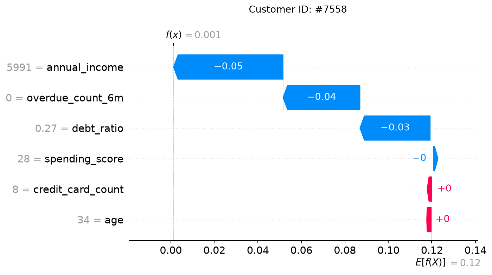

판정: **승인(저위험)**, 예측 연체 확률 **0.12%**, 관측 연체 라벨 0. 기준값 0.119657 + 기여도 합 -0.118414 = 0.001244.

| 변수 | 모델 입력값 | SHAP 기여(확률 %p) |
| --- | --- | --- |
| 나이 | 34.00 | +0.021 |
| 연 소득(만원) | 5991.00 | -5.032 |
| 소비 점수 | 28.00 | -0.154 |
| 부채비율 | 0.27 | -3.228 |
| 카드 수 | 8.00 | +0.085 |
| 최근 6개월 연체 횟수 | 0.00 | -3.533 |

주요 이유: 연 소득(만원) 5991.00가 기준 확률을 5.03%p 낮춤; 최근 6개월 연체 횟수 0.00가 기준 확률을 3.53%p 낮춤; 부채비율 0.27가 기준 확률을 3.23%p 낮춤.

**영업팀 설명 예시**

> 이 고객의 연체 가능성을 모델은 0.12%로 추정해 저위험으로 분류했습니다. 모델은 연 소득 5,991만원, 최근 6개월 연체 0회, 부채비율 27% 정보를 위험을 낮추는 근거로 반영했습니다. 이 중 가장 크게 작용한 정보는 연 소득 5,991만원입니다. 이는 현재 입력된 정보에 대한 모델의 판단이며, 고객의 실제 상환 가능성은 추가 확인이 필요합니다.

**페르소나와 연결:** C18 ‘연령 낮은 · 소비점수 낮은’의 관측 연체율은 0.00%이고, 이 대표 고객의 모델 추정치는 0.12%입니다. 앞의 값은 전체 군집의 관측 비율, 뒤의 값은 평가 고객 한 명의 예측이므로 같은 지표는 아닙니다. 대표 고객의 주요 기여 방향을 확인한 뒤 안내하며, 같은 군집의 나머지 고객에게 이 판정을 일괄 적용하지 않습니다.

**상담에서 확인할 내용:** 기존 거래에서 불편한 점과 원하는 혜택을 확인하고, 알림·결제 편의 등 유지 중심의 안내를 제공합니다. 낮은 연체 추정만으로 추가 대출이나 한도 확대를 권할 근거는 없으며, 상품 관심도는 따로 확인합니다.

### cluster_19: 고객 #3475 / C19

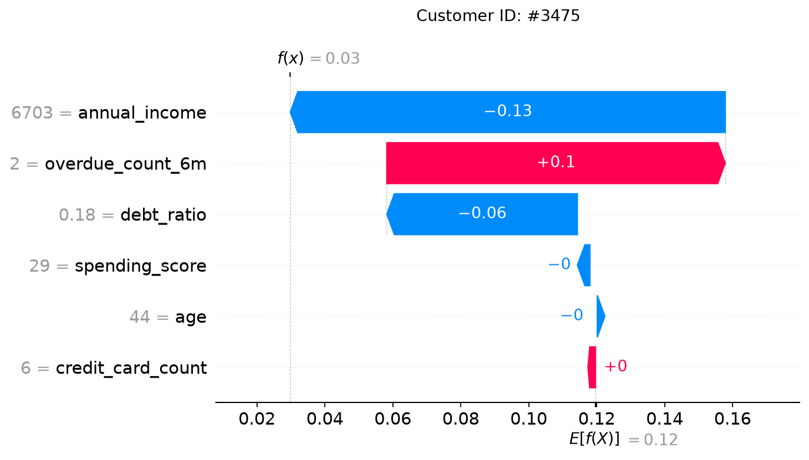

판정: **승인(저위험)**, 예측 연체 확률 **2.98%**, 관측 연체 라벨 0. 기준값 0.119657 + 기여도 합 -0.089819 = 0.029839.

| 변수 | 모델 입력값 | SHAP 기여(확률 %p) |
| --- | --- | --- |
| 나이 | 44.00 | -0.218 |
| 연 소득(만원) | 6703.00 | -12.800 |
| 소비 점수 | 29.00 | -0.369 |
| 부채비율 | 0.18 | -5.608 |
| 카드 수 | 6.00 | +0.054 |
| 최근 6개월 연체 횟수 | 2.00 | +9.960 |

주요 이유: 연 소득(만원) 6703.00가 기준 확률을 12.80%p 낮춤; 최근 6개월 연체 횟수 2.00가 기준 확률을 9.96%p 높임; 부채비율 0.18가 기준 확률을 5.61%p 낮춤.

**영업팀 설명 예시**

> 이 고객의 연체 가능성을 모델은 2.98%로 추정해 저위험으로 분류했습니다. 모델은 연 소득 6,703만원, 부채비율 18% 정보를 위험을 낮추는 근거로 반영했습니다. 모델은 최근 6개월 연체 2회 정보를 위험을 높이는 근거로 반영했습니다. 이 중 가장 크게 작용한 정보는 연 소득 6,703만원입니다. 이는 현재 입력된 정보에 대한 모델의 판단이며, 고객의 실제 상환 가능성은 추가 확인이 필요합니다.

**페르소나와 연결:** C19 ‘연체이력 많은 · 소비점수 낮은’의 관측 연체율은 18.09%이고, 이 대표 고객의 모델 추정치는 2.98%입니다. 앞의 값은 전체 군집의 관측 비율, 뒤의 값은 평가 고객 한 명의 예측이므로 같은 지표는 아닙니다. 최근 6개월 연체 횟수의 위험 증가 기여와 연 소득(만원)·부채비율의 위험 감소 기여가 함께 존재합니다. 군집의 평균적 특성만으로 이 고객의 위험을 단정하면 이런 차이를 놓칩니다.

**상담에서 확인할 내용:** 저위험 판정과 별개로 최근 연체의 발생 사유와 해소 여부를 확인합니다. “전체 위험 추정은 낮은 편이지만 최근 납부 이력이 있어, 결제일 알림이나 자동이체가 도움이 될지 확인하겠습니다”라고 안내합니다. 이 고객은 군집 단위 상담 대상 선정과 개별 판정을 분리해야 하는 사례입니다.

## 군집별 실행 제언과 효과 검증

분석이 뒷받침하는 첫 활용은 **상담 목적과 고객 접촉 방식을 구분하는 것**입니다. 연체 비중이 높은 군집에는 상환 일정 점검을, 낮은 군집에는 거래 편의와 관계 유지 안내를 우선 검토합니다. 군집별 관측 연체율은 접촉 대상을 정하는 근거이고, 실제 상담 효과나 상품 선호를 측정한 값은 아닙니다.

| 군집 | 평가 인원 | 관측 연체 고객 | 관측 연체율 | 전체 대비 집중도 | 모델 고위험 판정 인원 |
| --- | --- | --- | --- | --- | --- |
| C0 연령 낮은 · 소득 높은 | 130 | 3 | 2.31% | 0.19배 | 1 |
| C1 연체이력 많은 · 소비점수 높은 | 93 | 20 | 21.51% | 1.79배 | 21 |
| C2 다카드 · 소비점수 낮은 | 142 | 5 | 3.52% | 0.29배 | 1 |
| C3 부채비율 낮은 · 소비점수 낮은 | 121 | 1 | 0.83% | 0.07배 | 0 |
| C4 연령 낮은 · 부채비율 높은 | 160 | 44 | 27.50% | 2.29배 | 27 |
| C5 소비점수 높은 · 부채비율 낮은 | 149 | 0 | 0.00% | 0.00배 | 0 |
| C6 소수카드 · 소득 낮은 | 142 | 12 | 8.45% | 0.70배 | 6 |
| C7 부채비율 낮은 · 소비점수 높은 | 143 | 15 | 10.49% | 0.87배 | 8 |
| C8 연체이력 많은 · 소비점수 높은 | 68 | 19 | 27.94% | 2.33배 | 13 |
| C9 부채비율 높은 · 소수카드 | 149 | 37 | 24.83% | 2.07배 | 25 |
| C10 연령 낮은 · 부채비율 높은 | 139 | 1 | 0.72% | 0.06배 | 0 |
| C11 다카드 · 소비점수 높은 | 136 | 0 | 0.00% | 0.00배 | 0 |
| C12 연령 높은 · 소비점수 높은 | 114 | 0 | 0.00% | 0.00배 | 0 |
| C13 소비점수 낮은 · 소수카드 | 131 | 36 | 27.48% | 2.29배 | 27 |
| C14 다카드 · 부채비율 낮은 | 124 | 5 | 4.03% | 0.34배 | 7 |
| C15 소득 높은 · 연령 높은 | 110 | 3 | 2.73% | 0.23배 | 0 |
| C16 연체이력 많은 · 부채비율 높은 | 68 | 52 | 76.47% | 6.37배 | 53 |
| C17 연령 높은 · 부채비율 높은 | 152 | 37 | 24.34% | 2.03배 | 28 |
| C18 연령 낮은 · 소비점수 낮은 | 169 | 0 | 0.00% | 0.00배 | 0 |
| C19 연체이력 많은 · 소비점수 낮은 | 60 | 10 | 16.67% | 1.39배 | 1 |

연체 집중도 = 군집 관측 연체율 ÷ 전체 평가 연체율입니다. 관측 연체 고객과 모델 고위험 판정 고객은 서로 다른 집합이며 인원만으로 동일시할 수 없습니다. 아래 1,000명 기준 수치는 규모를 맞춘 비교 시나리오로, 실제 접촉 실적이 아닙니다.

### C0 ‘연령 낮은 · 소득 높은’: 거래 편의 중심의 유지 캠페인

**대상과 근거:** 관측 연체율은 2.31%로 전체 12.00%보다 낮습니다. 같은 구성이 유지된다면 연락 대상 1,000명에 포함될 연체 고객은 약 23.1명입니다. 상환 문제를 전제로 모든 고객에게 집중 상담을 하기보다, 디지털 안내를 통해 거래 편의와 관심사를 확인하는 실험이 적합합니다. 이 결과만으로 구매력·혜택 선호·유지율이 높다고 판단하지 않습니다.

**메시지와 실행:** “이용 중인 결제·알림 서비스에서 불편한 점이 있나요? 원하시는 편의 기능을 선택해 주세요.” 연락 가능한 고객에게 결제 알림과 이용 편의 기능을 간결하게 안내하고, 선택한 관심사에 따라 후속 메시지를 보냅니다. 군집 내에서도 모델 고위험 판정을 받은 고객은 개별 상황 확인 후 안내 목적을 정합니다. 상품 가입이나 추가 차입을 저위험 판정의 자동 후속 조치로 연결하지 않습니다.

**예상 효과의 가정과 계산:** 결과 데이터에 상품 반응이 없으므로 아래 수치는 예측치가 아닌 **캠페인 실험의 목표 시나리오**입니다. 발송 대상 1,000명당 14일 이내 편의 기능 활성화율을 기존 안내 3%, 관심사 선택형 안내 4%로 가정하면 활성 고객은 30명에서 40명으로 10명 늘어납니다. 절대 개선은 1%p, 상대 개선은 33.3%입니다. 낮은 연체율로부터 이 전환율을 추정한 것은 아닙니다.

| 관심사 선택형 안내 활성화율 가정 | 기존 3% 대비 추가 활성 고객 / 1,000명 |
| --- | --- |
| 3% — 효과 없음 | 0명 |
| 3.5% | 5명 |
| 4% — 목표 | 10명 |

**검증할 지표:** 14일 이내 편의 기능 활성화율을 1차 지표로 두고, 60일 서비스 유지율을 후속 지표로 확인합니다. 기능 활성화가 실제 거래 유지로 이어지는지 별도로 측정하며, 두 지표를 같은 성과로 취급하지 않습니다.

### C1 ‘연체이력 많은 · 소비점수 높은’: 상환 점검 상담을 우선 배정

**대상과 근거:** 평가 고객 93명 중 20명이 연체 라벨을 갖습니다. 같은 구성이 유지되는 모집단에서 무작위로 1,000명을 선정하면 전체 대상에서는 연체 고객 약 120.0명, 이 군집에서는 약 215.1명이 포함되는 셈입니다. 차이는 95.1명, 집중도는 1.79배입니다. 제한된 상담 자원을 어디에 먼저 시험 배정할지 판단하는 근거로 사용할 수 있습니다.

**메시지와 실행:** “최근 납부 일정에 어려움이 있었다면, 결제일과 상환 계획을 함께 점검해드리겠습니다.” 먼저 연체 해소 여부와 연락 의사를 확인하고, 결제일 알림·자동이체 설정·상환 일정 상담 중 고객 상황에 맞는 안내를 제공합니다. 군집 안에서는 개별 위험 추정과 현재 상황을 함께 확인합니다. 아래 효과 계산은 군집에서 무작위로 대상을 뽑는 가정이므로, 고위험 순으로 선별하는 경우에는 해당 대상의 위험 비중을 다시 측정해야 합니다.

**예상 효과의 가정과 계산:** 연락 시도 1,000명, 상담 도달률 60%, 도달 고객의 상대적 연체 감소율 10%를 **실험 설계용 가정**으로 둡니다. 도달 고객도 군집과 같은 위험 비중을 갖고, 관측 라벨 비율이 향후 동일한 정의·기간의 기준 연체율을 대변한다는 추가 가정이 필요합니다. 현재 데이터에는 연락 이력이나 시간 정보가 없어 이 가정들은 검증되지 않았습니다.

`연체 감소 인원 가정 = 1,000 × 0.215054 × 0.60 × 0.10 ≈ 12.9명`

같은 가정을 전체 대상에 적용하면 약 7.2명입니다. 이 차이는 대상의 위험 집중도에서 발생하며, 해당 군집에서 상담이 더 잘 통한다는 증거는 아닙니다.

| 도달 고객의 상대 감소율 가정 | 1,000명 연락 시 연체 감소 인원 가정 |
| --- | --- |
| 0% | 0.0명 |
| 5% | 6.5명 |
| 10% | 12.9명 |
| 15% | 19.4명 |

**검증할 지표:** 사전에 정의한 기간의 실제 연체 발생률을 1차 지표로 두고, 상담 도달률·완료율·알림 설정률을 과정 지표로 봅니다. 설정률만 높아지고 연체율이 줄지 않으면 위험 관리 성과를 확인한 것으로 보지 않습니다.

### C2 ‘다카드 · 소비점수 낮은’: 거래 편의 중심의 유지 캠페인

**대상과 근거:** 관측 연체율은 3.52%로 전체 12.00%보다 낮습니다. 같은 구성이 유지된다면 연락 대상 1,000명에 포함될 연체 고객은 약 35.2명입니다. 상환 문제를 전제로 모든 고객에게 집중 상담을 하기보다, 디지털 안내를 통해 거래 편의와 관심사를 확인하는 실험이 적합합니다. 이 결과만으로 구매력·혜택 선호·유지율이 높다고 판단하지 않습니다.

**메시지와 실행:** “이용 중인 결제·알림 서비스에서 불편한 점이 있나요? 원하시는 편의 기능을 선택해 주세요.” 연락 가능한 고객에게 결제 알림과 이용 편의 기능을 간결하게 안내하고, 선택한 관심사에 따라 후속 메시지를 보냅니다. 군집 내에서도 모델 고위험 판정을 받은 고객은 개별 상황 확인 후 안내 목적을 정합니다. 상품 가입이나 추가 차입을 저위험 판정의 자동 후속 조치로 연결하지 않습니다.

**예상 효과의 가정과 계산:** 결과 데이터에 상품 반응이 없으므로 아래 수치는 예측치가 아닌 **캠페인 실험의 목표 시나리오**입니다. 발송 대상 1,000명당 14일 이내 편의 기능 활성화율을 기존 안내 3%, 관심사 선택형 안내 4%로 가정하면 활성 고객은 30명에서 40명으로 10명 늘어납니다. 절대 개선은 1%p, 상대 개선은 33.3%입니다. 낮은 연체율로부터 이 전환율을 추정한 것은 아닙니다.

| 관심사 선택형 안내 활성화율 가정 | 기존 3% 대비 추가 활성 고객 / 1,000명 |
| --- | --- |
| 3% — 효과 없음 | 0명 |
| 3.5% | 5명 |
| 4% — 목표 | 10명 |

**검증할 지표:** 14일 이내 편의 기능 활성화율을 1차 지표로 두고, 60일 서비스 유지율을 후속 지표로 확인합니다. 기능 활성화가 실제 거래 유지로 이어지는지 별도로 측정하며, 두 지표를 같은 성과로 취급하지 않습니다.

### C3 ‘부채비율 낮은 · 소비점수 낮은’: 거래 편의 중심의 유지 캠페인

**대상과 근거:** 관측 연체율은 0.83%로 전체 12.00%보다 낮습니다. 같은 구성이 유지된다면 연락 대상 1,000명에 포함될 연체 고객은 약 8.3명입니다. 상환 문제를 전제로 모든 고객에게 집중 상담을 하기보다, 디지털 안내를 통해 거래 편의와 관심사를 확인하는 실험이 적합합니다. 이 결과만으로 구매력·혜택 선호·유지율이 높다고 판단하지 않습니다.

**메시지와 실행:** “이용 중인 결제·알림 서비스에서 불편한 점이 있나요? 원하시는 편의 기능을 선택해 주세요.” 연락 가능한 고객에게 결제 알림과 이용 편의 기능을 간결하게 안내하고, 선택한 관심사에 따라 후속 메시지를 보냅니다. 군집 내에서도 모델 고위험 판정을 받은 고객은 개별 상황 확인 후 안내 목적을 정합니다. 상품 가입이나 추가 차입을 저위험 판정의 자동 후속 조치로 연결하지 않습니다.

**예상 효과의 가정과 계산:** 결과 데이터에 상품 반응이 없으므로 아래 수치는 예측치가 아닌 **캠페인 실험의 목표 시나리오**입니다. 발송 대상 1,000명당 14일 이내 편의 기능 활성화율을 기존 안내 3%, 관심사 선택형 안내 4%로 가정하면 활성 고객은 30명에서 40명으로 10명 늘어납니다. 절대 개선은 1%p, 상대 개선은 33.3%입니다. 낮은 연체율로부터 이 전환율을 추정한 것은 아닙니다.

| 관심사 선택형 안내 활성화율 가정 | 기존 3% 대비 추가 활성 고객 / 1,000명 |
| --- | --- |
| 3% — 효과 없음 | 0명 |
| 3.5% | 5명 |
| 4% — 목표 | 10명 |

**검증할 지표:** 14일 이내 편의 기능 활성화율을 1차 지표로 두고, 60일 서비스 유지율을 후속 지표로 확인합니다. 기능 활성화가 실제 거래 유지로 이어지는지 별도로 측정하며, 두 지표를 같은 성과로 취급하지 않습니다.

### C4 ‘연령 낮은 · 부채비율 높은’: 상환 점검 상담을 우선 배정

**대상과 근거:** 평가 고객 160명 중 44명이 연체 라벨을 갖습니다. 같은 구성이 유지되는 모집단에서 무작위로 1,000명을 선정하면 전체 대상에서는 연체 고객 약 120.0명, 이 군집에서는 약 275.0명이 포함되는 셈입니다. 차이는 155.0명, 집중도는 2.29배입니다. 제한된 상담 자원을 어디에 먼저 시험 배정할지 판단하는 근거로 사용할 수 있습니다.

**메시지와 실행:** “최근 납부 일정에 어려움이 있었다면, 결제일과 상환 계획을 함께 점검해드리겠습니다.” 먼저 연체 해소 여부와 연락 의사를 확인하고, 결제일 알림·자동이체 설정·상환 일정 상담 중 고객 상황에 맞는 안내를 제공합니다. 군집 안에서는 개별 위험 추정과 현재 상황을 함께 확인합니다. 아래 효과 계산은 군집에서 무작위로 대상을 뽑는 가정이므로, 고위험 순으로 선별하는 경우에는 해당 대상의 위험 비중을 다시 측정해야 합니다.

**예상 효과의 가정과 계산:** 연락 시도 1,000명, 상담 도달률 60%, 도달 고객의 상대적 연체 감소율 10%를 **실험 설계용 가정**으로 둡니다. 도달 고객도 군집과 같은 위험 비중을 갖고, 관측 라벨 비율이 향후 동일한 정의·기간의 기준 연체율을 대변한다는 추가 가정이 필요합니다. 현재 데이터에는 연락 이력이나 시간 정보가 없어 이 가정들은 검증되지 않았습니다.

`연체 감소 인원 가정 = 1,000 × 0.275000 × 0.60 × 0.10 ≈ 16.5명`

같은 가정을 전체 대상에 적용하면 약 7.2명입니다. 이 차이는 대상의 위험 집중도에서 발생하며, 해당 군집에서 상담이 더 잘 통한다는 증거는 아닙니다.

| 도달 고객의 상대 감소율 가정 | 1,000명 연락 시 연체 감소 인원 가정 |
| --- | --- |
| 0% | 0.0명 |
| 5% | 8.2명 |
| 10% | 16.5명 |
| 15% | 24.8명 |

**검증할 지표:** 사전에 정의한 기간의 실제 연체 발생률을 1차 지표로 두고, 상담 도달률·완료율·알림 설정률을 과정 지표로 봅니다. 설정률만 높아지고 연체율이 줄지 않으면 위험 관리 성과를 확인한 것으로 보지 않습니다.

### C5 ‘소비점수 높은 · 부채비율 낮은’: 거래 편의 중심의 유지 캠페인

**대상과 근거:** 관측 연체율은 0.00%로 전체 12.00%보다 낮습니다. 같은 구성이 유지된다면 연락 대상 1,000명에 포함될 연체 고객은 약 0.0명입니다. 상환 문제를 전제로 모든 고객에게 집중 상담을 하기보다, 디지털 안내를 통해 거래 편의와 관심사를 확인하는 실험이 적합합니다. 이 결과만으로 구매력·혜택 선호·유지율이 높다고 판단하지 않습니다.

**메시지와 실행:** “이용 중인 결제·알림 서비스에서 불편한 점이 있나요? 원하시는 편의 기능을 선택해 주세요.” 연락 가능한 고객에게 결제 알림과 이용 편의 기능을 간결하게 안내하고, 선택한 관심사에 따라 후속 메시지를 보냅니다. 군집 내에서도 모델 고위험 판정을 받은 고객은 개별 상황 확인 후 안내 목적을 정합니다. 상품 가입이나 추가 차입을 저위험 판정의 자동 후속 조치로 연결하지 않습니다.

**예상 효과의 가정과 계산:** 결과 데이터에 상품 반응이 없으므로 아래 수치는 예측치가 아닌 **캠페인 실험의 목표 시나리오**입니다. 발송 대상 1,000명당 14일 이내 편의 기능 활성화율을 기존 안내 3%, 관심사 선택형 안내 4%로 가정하면 활성 고객은 30명에서 40명으로 10명 늘어납니다. 절대 개선은 1%p, 상대 개선은 33.3%입니다. 낮은 연체율로부터 이 전환율을 추정한 것은 아닙니다.

| 관심사 선택형 안내 활성화율 가정 | 기존 3% 대비 추가 활성 고객 / 1,000명 |
| --- | --- |
| 3% — 효과 없음 | 0명 |
| 3.5% | 5명 |
| 4% — 목표 | 10명 |

**검증할 지표:** 14일 이내 편의 기능 활성화율을 1차 지표로 두고, 60일 서비스 유지율을 후속 지표로 확인합니다. 기능 활성화가 실제 거래 유지로 이어지는지 별도로 측정하며, 두 지표를 같은 성과로 취급하지 않습니다.

### C6 ‘소수카드 · 소득 낮은’: 거래 편의 중심의 유지 캠페인

**대상과 근거:** 관측 연체율은 8.45%로 전체 12.00%보다 낮습니다. 같은 구성이 유지된다면 연락 대상 1,000명에 포함될 연체 고객은 약 84.5명입니다. 상환 문제를 전제로 모든 고객에게 집중 상담을 하기보다, 디지털 안내를 통해 거래 편의와 관심사를 확인하는 실험이 적합합니다. 이 결과만으로 구매력·혜택 선호·유지율이 높다고 판단하지 않습니다.

**메시지와 실행:** “이용 중인 결제·알림 서비스에서 불편한 점이 있나요? 원하시는 편의 기능을 선택해 주세요.” 연락 가능한 고객에게 결제 알림과 이용 편의 기능을 간결하게 안내하고, 선택한 관심사에 따라 후속 메시지를 보냅니다. 군집 내에서도 모델 고위험 판정을 받은 고객은 개별 상황 확인 후 안내 목적을 정합니다. 상품 가입이나 추가 차입을 저위험 판정의 자동 후속 조치로 연결하지 않습니다.

**예상 효과의 가정과 계산:** 결과 데이터에 상품 반응이 없으므로 아래 수치는 예측치가 아닌 **캠페인 실험의 목표 시나리오**입니다. 발송 대상 1,000명당 14일 이내 편의 기능 활성화율을 기존 안내 3%, 관심사 선택형 안내 4%로 가정하면 활성 고객은 30명에서 40명으로 10명 늘어납니다. 절대 개선은 1%p, 상대 개선은 33.3%입니다. 낮은 연체율로부터 이 전환율을 추정한 것은 아닙니다.

| 관심사 선택형 안내 활성화율 가정 | 기존 3% 대비 추가 활성 고객 / 1,000명 |
| --- | --- |
| 3% — 효과 없음 | 0명 |
| 3.5% | 5명 |
| 4% — 목표 | 10명 |

**검증할 지표:** 14일 이내 편의 기능 활성화율을 1차 지표로 두고, 60일 서비스 유지율을 후속 지표로 확인합니다. 기능 활성화가 실제 거래 유지로 이어지는지 별도로 측정하며, 두 지표를 같은 성과로 취급하지 않습니다.

### C7 ‘부채비율 낮은 · 소비점수 높은’: 거래 편의 중심의 유지 캠페인

**대상과 근거:** 관측 연체율은 10.49%로 전체 12.00%보다 낮습니다. 같은 구성이 유지된다면 연락 대상 1,000명에 포함될 연체 고객은 약 104.9명입니다. 상환 문제를 전제로 모든 고객에게 집중 상담을 하기보다, 디지털 안내를 통해 거래 편의와 관심사를 확인하는 실험이 적합합니다. 이 결과만으로 구매력·혜택 선호·유지율이 높다고 판단하지 않습니다.

**메시지와 실행:** “이용 중인 결제·알림 서비스에서 불편한 점이 있나요? 원하시는 편의 기능을 선택해 주세요.” 연락 가능한 고객에게 결제 알림과 이용 편의 기능을 간결하게 안내하고, 선택한 관심사에 따라 후속 메시지를 보냅니다. 군집 내에서도 모델 고위험 판정을 받은 고객은 개별 상황 확인 후 안내 목적을 정합니다. 상품 가입이나 추가 차입을 저위험 판정의 자동 후속 조치로 연결하지 않습니다.

**예상 효과의 가정과 계산:** 결과 데이터에 상품 반응이 없으므로 아래 수치는 예측치가 아닌 **캠페인 실험의 목표 시나리오**입니다. 발송 대상 1,000명당 14일 이내 편의 기능 활성화율을 기존 안내 3%, 관심사 선택형 안내 4%로 가정하면 활성 고객은 30명에서 40명으로 10명 늘어납니다. 절대 개선은 1%p, 상대 개선은 33.3%입니다. 낮은 연체율로부터 이 전환율을 추정한 것은 아닙니다.

| 관심사 선택형 안내 활성화율 가정 | 기존 3% 대비 추가 활성 고객 / 1,000명 |
| --- | --- |
| 3% — 효과 없음 | 0명 |
| 3.5% | 5명 |
| 4% — 목표 | 10명 |

**검증할 지표:** 14일 이내 편의 기능 활성화율을 1차 지표로 두고, 60일 서비스 유지율을 후속 지표로 확인합니다. 기능 활성화가 실제 거래 유지로 이어지는지 별도로 측정하며, 두 지표를 같은 성과로 취급하지 않습니다.

### C8 ‘연체이력 많은 · 소비점수 높은’: 상환 점검 상담을 우선 배정

**대상과 근거:** 평가 고객 68명 중 19명이 연체 라벨을 갖습니다. 같은 구성이 유지되는 모집단에서 무작위로 1,000명을 선정하면 전체 대상에서는 연체 고객 약 120.0명, 이 군집에서는 약 279.4명이 포함되는 셈입니다. 차이는 159.4명, 집중도는 2.33배입니다. 제한된 상담 자원을 어디에 먼저 시험 배정할지 판단하는 근거로 사용할 수 있습니다.

**메시지와 실행:** “최근 납부 일정에 어려움이 있었다면, 결제일과 상환 계획을 함께 점검해드리겠습니다.” 먼저 연체 해소 여부와 연락 의사를 확인하고, 결제일 알림·자동이체 설정·상환 일정 상담 중 고객 상황에 맞는 안내를 제공합니다. 군집 안에서는 개별 위험 추정과 현재 상황을 함께 확인합니다. 아래 효과 계산은 군집에서 무작위로 대상을 뽑는 가정이므로, 고위험 순으로 선별하는 경우에는 해당 대상의 위험 비중을 다시 측정해야 합니다.

**예상 효과의 가정과 계산:** 연락 시도 1,000명, 상담 도달률 60%, 도달 고객의 상대적 연체 감소율 10%를 **실험 설계용 가정**으로 둡니다. 도달 고객도 군집과 같은 위험 비중을 갖고, 관측 라벨 비율이 향후 동일한 정의·기간의 기준 연체율을 대변한다는 추가 가정이 필요합니다. 현재 데이터에는 연락 이력이나 시간 정보가 없어 이 가정들은 검증되지 않았습니다.

`연체 감소 인원 가정 = 1,000 × 0.279412 × 0.60 × 0.10 ≈ 16.8명`

같은 가정을 전체 대상에 적용하면 약 7.2명입니다. 이 차이는 대상의 위험 집중도에서 발생하며, 해당 군집에서 상담이 더 잘 통한다는 증거는 아닙니다.

| 도달 고객의 상대 감소율 가정 | 1,000명 연락 시 연체 감소 인원 가정 |
| --- | --- |
| 0% | 0.0명 |
| 5% | 8.4명 |
| 10% | 16.8명 |
| 15% | 25.1명 |

**검증할 지표:** 사전에 정의한 기간의 실제 연체 발생률을 1차 지표로 두고, 상담 도달률·완료율·알림 설정률을 과정 지표로 봅니다. 설정률만 높아지고 연체율이 줄지 않으면 위험 관리 성과를 확인한 것으로 보지 않습니다.

### C9 ‘부채비율 높은 · 소수카드’: 상환 점검 상담을 우선 배정

**대상과 근거:** 평가 고객 149명 중 37명이 연체 라벨을 갖습니다. 같은 구성이 유지되는 모집단에서 무작위로 1,000명을 선정하면 전체 대상에서는 연체 고객 약 120.0명, 이 군집에서는 약 248.3명이 포함되는 셈입니다. 차이는 128.3명, 집중도는 2.07배입니다. 제한된 상담 자원을 어디에 먼저 시험 배정할지 판단하는 근거로 사용할 수 있습니다.

**메시지와 실행:** “최근 납부 일정에 어려움이 있었다면, 결제일과 상환 계획을 함께 점검해드리겠습니다.” 먼저 연체 해소 여부와 연락 의사를 확인하고, 결제일 알림·자동이체 설정·상환 일정 상담 중 고객 상황에 맞는 안내를 제공합니다. 군집 안에서는 개별 위험 추정과 현재 상황을 함께 확인합니다. 아래 효과 계산은 군집에서 무작위로 대상을 뽑는 가정이므로, 고위험 순으로 선별하는 경우에는 해당 대상의 위험 비중을 다시 측정해야 합니다.

**예상 효과의 가정과 계산:** 연락 시도 1,000명, 상담 도달률 60%, 도달 고객의 상대적 연체 감소율 10%를 **실험 설계용 가정**으로 둡니다. 도달 고객도 군집과 같은 위험 비중을 갖고, 관측 라벨 비율이 향후 동일한 정의·기간의 기준 연체율을 대변한다는 추가 가정이 필요합니다. 현재 데이터에는 연락 이력이나 시간 정보가 없어 이 가정들은 검증되지 않았습니다.

`연체 감소 인원 가정 = 1,000 × 0.248322 × 0.60 × 0.10 ≈ 14.9명`

같은 가정을 전체 대상에 적용하면 약 7.2명입니다. 이 차이는 대상의 위험 집중도에서 발생하며, 해당 군집에서 상담이 더 잘 통한다는 증거는 아닙니다.

| 도달 고객의 상대 감소율 가정 | 1,000명 연락 시 연체 감소 인원 가정 |
| --- | --- |
| 0% | 0.0명 |
| 5% | 7.4명 |
| 10% | 14.9명 |
| 15% | 22.3명 |

**검증할 지표:** 사전에 정의한 기간의 실제 연체 발생률을 1차 지표로 두고, 상담 도달률·완료율·알림 설정률을 과정 지표로 봅니다. 설정률만 높아지고 연체율이 줄지 않으면 위험 관리 성과를 확인한 것으로 보지 않습니다.

### C10 ‘연령 낮은 · 부채비율 높은’: 거래 편의 중심의 유지 캠페인

**대상과 근거:** 관측 연체율은 0.72%로 전체 12.00%보다 낮습니다. 같은 구성이 유지된다면 연락 대상 1,000명에 포함될 연체 고객은 약 7.2명입니다. 상환 문제를 전제로 모든 고객에게 집중 상담을 하기보다, 디지털 안내를 통해 거래 편의와 관심사를 확인하는 실험이 적합합니다. 이 결과만으로 구매력·혜택 선호·유지율이 높다고 판단하지 않습니다.

**메시지와 실행:** “이용 중인 결제·알림 서비스에서 불편한 점이 있나요? 원하시는 편의 기능을 선택해 주세요.” 연락 가능한 고객에게 결제 알림과 이용 편의 기능을 간결하게 안내하고, 선택한 관심사에 따라 후속 메시지를 보냅니다. 군집 내에서도 모델 고위험 판정을 받은 고객은 개별 상황 확인 후 안내 목적을 정합니다. 상품 가입이나 추가 차입을 저위험 판정의 자동 후속 조치로 연결하지 않습니다.

**예상 효과의 가정과 계산:** 결과 데이터에 상품 반응이 없으므로 아래 수치는 예측치가 아닌 **캠페인 실험의 목표 시나리오**입니다. 발송 대상 1,000명당 14일 이내 편의 기능 활성화율을 기존 안내 3%, 관심사 선택형 안내 4%로 가정하면 활성 고객은 30명에서 40명으로 10명 늘어납니다. 절대 개선은 1%p, 상대 개선은 33.3%입니다. 낮은 연체율로부터 이 전환율을 추정한 것은 아닙니다.

| 관심사 선택형 안내 활성화율 가정 | 기존 3% 대비 추가 활성 고객 / 1,000명 |
| --- | --- |
| 3% — 효과 없음 | 0명 |
| 3.5% | 5명 |
| 4% — 목표 | 10명 |

**검증할 지표:** 14일 이내 편의 기능 활성화율을 1차 지표로 두고, 60일 서비스 유지율을 후속 지표로 확인합니다. 기능 활성화가 실제 거래 유지로 이어지는지 별도로 측정하며, 두 지표를 같은 성과로 취급하지 않습니다.

### C11 ‘다카드 · 소비점수 높은’: 거래 편의 중심의 유지 캠페인

**대상과 근거:** 관측 연체율은 0.00%로 전체 12.00%보다 낮습니다. 같은 구성이 유지된다면 연락 대상 1,000명에 포함될 연체 고객은 약 0.0명입니다. 상환 문제를 전제로 모든 고객에게 집중 상담을 하기보다, 디지털 안내를 통해 거래 편의와 관심사를 확인하는 실험이 적합합니다. 이 결과만으로 구매력·혜택 선호·유지율이 높다고 판단하지 않습니다.

**메시지와 실행:** “이용 중인 결제·알림 서비스에서 불편한 점이 있나요? 원하시는 편의 기능을 선택해 주세요.” 연락 가능한 고객에게 결제 알림과 이용 편의 기능을 간결하게 안내하고, 선택한 관심사에 따라 후속 메시지를 보냅니다. 군집 내에서도 모델 고위험 판정을 받은 고객은 개별 상황 확인 후 안내 목적을 정합니다. 상품 가입이나 추가 차입을 저위험 판정의 자동 후속 조치로 연결하지 않습니다.

**예상 효과의 가정과 계산:** 결과 데이터에 상품 반응이 없으므로 아래 수치는 예측치가 아닌 **캠페인 실험의 목표 시나리오**입니다. 발송 대상 1,000명당 14일 이내 편의 기능 활성화율을 기존 안내 3%, 관심사 선택형 안내 4%로 가정하면 활성 고객은 30명에서 40명으로 10명 늘어납니다. 절대 개선은 1%p, 상대 개선은 33.3%입니다. 낮은 연체율로부터 이 전환율을 추정한 것은 아닙니다.

| 관심사 선택형 안내 활성화율 가정 | 기존 3% 대비 추가 활성 고객 / 1,000명 |
| --- | --- |
| 3% — 효과 없음 | 0명 |
| 3.5% | 5명 |
| 4% — 목표 | 10명 |

**검증할 지표:** 14일 이내 편의 기능 활성화율을 1차 지표로 두고, 60일 서비스 유지율을 후속 지표로 확인합니다. 기능 활성화가 실제 거래 유지로 이어지는지 별도로 측정하며, 두 지표를 같은 성과로 취급하지 않습니다.

### C12 ‘연령 높은 · 소비점수 높은’: 거래 편의 중심의 유지 캠페인

**대상과 근거:** 관측 연체율은 0.00%로 전체 12.00%보다 낮습니다. 같은 구성이 유지된다면 연락 대상 1,000명에 포함될 연체 고객은 약 0.0명입니다. 상환 문제를 전제로 모든 고객에게 집중 상담을 하기보다, 디지털 안내를 통해 거래 편의와 관심사를 확인하는 실험이 적합합니다. 이 결과만으로 구매력·혜택 선호·유지율이 높다고 판단하지 않습니다.

**메시지와 실행:** “이용 중인 결제·알림 서비스에서 불편한 점이 있나요? 원하시는 편의 기능을 선택해 주세요.” 연락 가능한 고객에게 결제 알림과 이용 편의 기능을 간결하게 안내하고, 선택한 관심사에 따라 후속 메시지를 보냅니다. 군집 내에서도 모델 고위험 판정을 받은 고객은 개별 상황 확인 후 안내 목적을 정합니다. 상품 가입이나 추가 차입을 저위험 판정의 자동 후속 조치로 연결하지 않습니다.

**예상 효과의 가정과 계산:** 결과 데이터에 상품 반응이 없으므로 아래 수치는 예측치가 아닌 **캠페인 실험의 목표 시나리오**입니다. 발송 대상 1,000명당 14일 이내 편의 기능 활성화율을 기존 안내 3%, 관심사 선택형 안내 4%로 가정하면 활성 고객은 30명에서 40명으로 10명 늘어납니다. 절대 개선은 1%p, 상대 개선은 33.3%입니다. 낮은 연체율로부터 이 전환율을 추정한 것은 아닙니다.

| 관심사 선택형 안내 활성화율 가정 | 기존 3% 대비 추가 활성 고객 / 1,000명 |
| --- | --- |
| 3% — 효과 없음 | 0명 |
| 3.5% | 5명 |
| 4% — 목표 | 10명 |

**검증할 지표:** 14일 이내 편의 기능 활성화율을 1차 지표로 두고, 60일 서비스 유지율을 후속 지표로 확인합니다. 기능 활성화가 실제 거래 유지로 이어지는지 별도로 측정하며, 두 지표를 같은 성과로 취급하지 않습니다.

### C13 ‘소비점수 낮은 · 소수카드’: 상환 점검 상담을 우선 배정

**대상과 근거:** 평가 고객 131명 중 36명이 연체 라벨을 갖습니다. 같은 구성이 유지되는 모집단에서 무작위로 1,000명을 선정하면 전체 대상에서는 연체 고객 약 120.0명, 이 군집에서는 약 274.8명이 포함되는 셈입니다. 차이는 154.8명, 집중도는 2.29배입니다. 제한된 상담 자원을 어디에 먼저 시험 배정할지 판단하는 근거로 사용할 수 있습니다.

**메시지와 실행:** “최근 납부 일정에 어려움이 있었다면, 결제일과 상환 계획을 함께 점검해드리겠습니다.” 먼저 연체 해소 여부와 연락 의사를 확인하고, 결제일 알림·자동이체 설정·상환 일정 상담 중 고객 상황에 맞는 안내를 제공합니다. 군집 안에서는 개별 위험 추정과 현재 상황을 함께 확인합니다. 아래 효과 계산은 군집에서 무작위로 대상을 뽑는 가정이므로, 고위험 순으로 선별하는 경우에는 해당 대상의 위험 비중을 다시 측정해야 합니다.

**예상 효과의 가정과 계산:** 연락 시도 1,000명, 상담 도달률 60%, 도달 고객의 상대적 연체 감소율 10%를 **실험 설계용 가정**으로 둡니다. 도달 고객도 군집과 같은 위험 비중을 갖고, 관측 라벨 비율이 향후 동일한 정의·기간의 기준 연체율을 대변한다는 추가 가정이 필요합니다. 현재 데이터에는 연락 이력이나 시간 정보가 없어 이 가정들은 검증되지 않았습니다.

`연체 감소 인원 가정 = 1,000 × 0.274809 × 0.60 × 0.10 ≈ 16.5명`

같은 가정을 전체 대상에 적용하면 약 7.2명입니다. 이 차이는 대상의 위험 집중도에서 발생하며, 해당 군집에서 상담이 더 잘 통한다는 증거는 아닙니다.

| 도달 고객의 상대 감소율 가정 | 1,000명 연락 시 연체 감소 인원 가정 |
| --- | --- |
| 0% | 0.0명 |
| 5% | 8.2명 |
| 10% | 16.5명 |
| 15% | 24.7명 |

**검증할 지표:** 사전에 정의한 기간의 실제 연체 발생률을 1차 지표로 두고, 상담 도달률·완료율·알림 설정률을 과정 지표로 봅니다. 설정률만 높아지고 연체율이 줄지 않으면 위험 관리 성과를 확인한 것으로 보지 않습니다.

### C14 ‘다카드 · 부채비율 낮은’: 거래 편의 중심의 유지 캠페인

**대상과 근거:** 관측 연체율은 4.03%로 전체 12.00%보다 낮습니다. 같은 구성이 유지된다면 연락 대상 1,000명에 포함될 연체 고객은 약 40.3명입니다. 상환 문제를 전제로 모든 고객에게 집중 상담을 하기보다, 디지털 안내를 통해 거래 편의와 관심사를 확인하는 실험이 적합합니다. 이 결과만으로 구매력·혜택 선호·유지율이 높다고 판단하지 않습니다.

**메시지와 실행:** “이용 중인 결제·알림 서비스에서 불편한 점이 있나요? 원하시는 편의 기능을 선택해 주세요.” 연락 가능한 고객에게 결제 알림과 이용 편의 기능을 간결하게 안내하고, 선택한 관심사에 따라 후속 메시지를 보냅니다. 군집 내에서도 모델 고위험 판정을 받은 고객은 개별 상황 확인 후 안내 목적을 정합니다. 상품 가입이나 추가 차입을 저위험 판정의 자동 후속 조치로 연결하지 않습니다.

**예상 효과의 가정과 계산:** 결과 데이터에 상품 반응이 없으므로 아래 수치는 예측치가 아닌 **캠페인 실험의 목표 시나리오**입니다. 발송 대상 1,000명당 14일 이내 편의 기능 활성화율을 기존 안내 3%, 관심사 선택형 안내 4%로 가정하면 활성 고객은 30명에서 40명으로 10명 늘어납니다. 절대 개선은 1%p, 상대 개선은 33.3%입니다. 낮은 연체율로부터 이 전환율을 추정한 것은 아닙니다.

| 관심사 선택형 안내 활성화율 가정 | 기존 3% 대비 추가 활성 고객 / 1,000명 |
| --- | --- |
| 3% — 효과 없음 | 0명 |
| 3.5% | 5명 |
| 4% — 목표 | 10명 |

**검증할 지표:** 14일 이내 편의 기능 활성화율을 1차 지표로 두고, 60일 서비스 유지율을 후속 지표로 확인합니다. 기능 활성화가 실제 거래 유지로 이어지는지 별도로 측정하며, 두 지표를 같은 성과로 취급하지 않습니다.

### C15 ‘소득 높은 · 연령 높은’: 거래 편의 중심의 유지 캠페인

**대상과 근거:** 관측 연체율은 2.73%로 전체 12.00%보다 낮습니다. 같은 구성이 유지된다면 연락 대상 1,000명에 포함될 연체 고객은 약 27.3명입니다. 상환 문제를 전제로 모든 고객에게 집중 상담을 하기보다, 디지털 안내를 통해 거래 편의와 관심사를 확인하는 실험이 적합합니다. 이 결과만으로 구매력·혜택 선호·유지율이 높다고 판단하지 않습니다.

**메시지와 실행:** “이용 중인 결제·알림 서비스에서 불편한 점이 있나요? 원하시는 편의 기능을 선택해 주세요.” 연락 가능한 고객에게 결제 알림과 이용 편의 기능을 간결하게 안내하고, 선택한 관심사에 따라 후속 메시지를 보냅니다. 군집 내에서도 모델 고위험 판정을 받은 고객은 개별 상황 확인 후 안내 목적을 정합니다. 상품 가입이나 추가 차입을 저위험 판정의 자동 후속 조치로 연결하지 않습니다.

**예상 효과의 가정과 계산:** 결과 데이터에 상품 반응이 없으므로 아래 수치는 예측치가 아닌 **캠페인 실험의 목표 시나리오**입니다. 발송 대상 1,000명당 14일 이내 편의 기능 활성화율을 기존 안내 3%, 관심사 선택형 안내 4%로 가정하면 활성 고객은 30명에서 40명으로 10명 늘어납니다. 절대 개선은 1%p, 상대 개선은 33.3%입니다. 낮은 연체율로부터 이 전환율을 추정한 것은 아닙니다.

| 관심사 선택형 안내 활성화율 가정 | 기존 3% 대비 추가 활성 고객 / 1,000명 |
| --- | --- |
| 3% — 효과 없음 | 0명 |
| 3.5% | 5명 |
| 4% — 목표 | 10명 |

**검증할 지표:** 14일 이내 편의 기능 활성화율을 1차 지표로 두고, 60일 서비스 유지율을 후속 지표로 확인합니다. 기능 활성화가 실제 거래 유지로 이어지는지 별도로 측정하며, 두 지표를 같은 성과로 취급하지 않습니다.

### C16 ‘연체이력 많은 · 부채비율 높은’: 상환 점검 상담을 우선 배정

**대상과 근거:** 평가 고객 68명 중 52명이 연체 라벨을 갖습니다. 같은 구성이 유지되는 모집단에서 무작위로 1,000명을 선정하면 전체 대상에서는 연체 고객 약 120.0명, 이 군집에서는 약 764.7명이 포함되는 셈입니다. 차이는 644.7명, 집중도는 6.37배입니다. 제한된 상담 자원을 어디에 먼저 시험 배정할지 판단하는 근거로 사용할 수 있습니다.

**메시지와 실행:** “최근 납부 일정에 어려움이 있었다면, 결제일과 상환 계획을 함께 점검해드리겠습니다.” 먼저 연체 해소 여부와 연락 의사를 확인하고, 결제일 알림·자동이체 설정·상환 일정 상담 중 고객 상황에 맞는 안내를 제공합니다. 군집 안에서는 개별 위험 추정과 현재 상황을 함께 확인합니다. 아래 효과 계산은 군집에서 무작위로 대상을 뽑는 가정이므로, 고위험 순으로 선별하는 경우에는 해당 대상의 위험 비중을 다시 측정해야 합니다.

**예상 효과의 가정과 계산:** 연락 시도 1,000명, 상담 도달률 60%, 도달 고객의 상대적 연체 감소율 10%를 **실험 설계용 가정**으로 둡니다. 도달 고객도 군집과 같은 위험 비중을 갖고, 관측 라벨 비율이 향후 동일한 정의·기간의 기준 연체율을 대변한다는 추가 가정이 필요합니다. 현재 데이터에는 연락 이력이나 시간 정보가 없어 이 가정들은 검증되지 않았습니다.

`연체 감소 인원 가정 = 1,000 × 0.764706 × 0.60 × 0.10 ≈ 45.9명`

같은 가정을 전체 대상에 적용하면 약 7.2명입니다. 이 차이는 대상의 위험 집중도에서 발생하며, 해당 군집에서 상담이 더 잘 통한다는 증거는 아닙니다.

| 도달 고객의 상대 감소율 가정 | 1,000명 연락 시 연체 감소 인원 가정 |
| --- | --- |
| 0% | 0.0명 |
| 5% | 22.9명 |
| 10% | 45.9명 |
| 15% | 68.8명 |

**검증할 지표:** 사전에 정의한 기간의 실제 연체 발생률을 1차 지표로 두고, 상담 도달률·완료율·알림 설정률을 과정 지표로 봅니다. 설정률만 높아지고 연체율이 줄지 않으면 위험 관리 성과를 확인한 것으로 보지 않습니다.

### C17 ‘연령 높은 · 부채비율 높은’: 상환 점검 상담을 우선 배정

**대상과 근거:** 평가 고객 152명 중 37명이 연체 라벨을 갖습니다. 같은 구성이 유지되는 모집단에서 무작위로 1,000명을 선정하면 전체 대상에서는 연체 고객 약 120.0명, 이 군집에서는 약 243.4명이 포함되는 셈입니다. 차이는 123.4명, 집중도는 2.03배입니다. 제한된 상담 자원을 어디에 먼저 시험 배정할지 판단하는 근거로 사용할 수 있습니다.

**메시지와 실행:** “최근 납부 일정에 어려움이 있었다면, 결제일과 상환 계획을 함께 점검해드리겠습니다.” 먼저 연체 해소 여부와 연락 의사를 확인하고, 결제일 알림·자동이체 설정·상환 일정 상담 중 고객 상황에 맞는 안내를 제공합니다. 군집 안에서는 개별 위험 추정과 현재 상황을 함께 확인합니다. 아래 효과 계산은 군집에서 무작위로 대상을 뽑는 가정이므로, 고위험 순으로 선별하는 경우에는 해당 대상의 위험 비중을 다시 측정해야 합니다.

**예상 효과의 가정과 계산:** 연락 시도 1,000명, 상담 도달률 60%, 도달 고객의 상대적 연체 감소율 10%를 **실험 설계용 가정**으로 둡니다. 도달 고객도 군집과 같은 위험 비중을 갖고, 관측 라벨 비율이 향후 동일한 정의·기간의 기준 연체율을 대변한다는 추가 가정이 필요합니다. 현재 데이터에는 연락 이력이나 시간 정보가 없어 이 가정들은 검증되지 않았습니다.

`연체 감소 인원 가정 = 1,000 × 0.243421 × 0.60 × 0.10 ≈ 14.6명`

같은 가정을 전체 대상에 적용하면 약 7.2명입니다. 이 차이는 대상의 위험 집중도에서 발생하며, 해당 군집에서 상담이 더 잘 통한다는 증거는 아닙니다.

| 도달 고객의 상대 감소율 가정 | 1,000명 연락 시 연체 감소 인원 가정 |
| --- | --- |
| 0% | 0.0명 |
| 5% | 7.3명 |
| 10% | 14.6명 |
| 15% | 21.9명 |

**검증할 지표:** 사전에 정의한 기간의 실제 연체 발생률을 1차 지표로 두고, 상담 도달률·완료율·알림 설정률을 과정 지표로 봅니다. 설정률만 높아지고 연체율이 줄지 않으면 위험 관리 성과를 확인한 것으로 보지 않습니다.

### C18 ‘연령 낮은 · 소비점수 낮은’: 거래 편의 중심의 유지 캠페인

**대상과 근거:** 관측 연체율은 0.00%로 전체 12.00%보다 낮습니다. 같은 구성이 유지된다면 연락 대상 1,000명에 포함될 연체 고객은 약 0.0명입니다. 상환 문제를 전제로 모든 고객에게 집중 상담을 하기보다, 디지털 안내를 통해 거래 편의와 관심사를 확인하는 실험이 적합합니다. 이 결과만으로 구매력·혜택 선호·유지율이 높다고 판단하지 않습니다.

**메시지와 실행:** “이용 중인 결제·알림 서비스에서 불편한 점이 있나요? 원하시는 편의 기능을 선택해 주세요.” 연락 가능한 고객에게 결제 알림과 이용 편의 기능을 간결하게 안내하고, 선택한 관심사에 따라 후속 메시지를 보냅니다. 군집 내에서도 모델 고위험 판정을 받은 고객은 개별 상황 확인 후 안내 목적을 정합니다. 상품 가입이나 추가 차입을 저위험 판정의 자동 후속 조치로 연결하지 않습니다.

**예상 효과의 가정과 계산:** 결과 데이터에 상품 반응이 없으므로 아래 수치는 예측치가 아닌 **캠페인 실험의 목표 시나리오**입니다. 발송 대상 1,000명당 14일 이내 편의 기능 활성화율을 기존 안내 3%, 관심사 선택형 안내 4%로 가정하면 활성 고객은 30명에서 40명으로 10명 늘어납니다. 절대 개선은 1%p, 상대 개선은 33.3%입니다. 낮은 연체율로부터 이 전환율을 추정한 것은 아닙니다.

| 관심사 선택형 안내 활성화율 가정 | 기존 3% 대비 추가 활성 고객 / 1,000명 |
| --- | --- |
| 3% — 효과 없음 | 0명 |
| 3.5% | 5명 |
| 4% — 목표 | 10명 |

**검증할 지표:** 14일 이내 편의 기능 활성화율을 1차 지표로 두고, 60일 서비스 유지율을 후속 지표로 확인합니다. 기능 활성화가 실제 거래 유지로 이어지는지 별도로 측정하며, 두 지표를 같은 성과로 취급하지 않습니다.

### C19 ‘연체이력 많은 · 소비점수 낮은’: 상환 점검 상담을 우선 배정

**대상과 근거:** 평가 고객 60명 중 10명이 연체 라벨을 갖습니다. 같은 구성이 유지되는 모집단에서 무작위로 1,000명을 선정하면 전체 대상에서는 연체 고객 약 120.0명, 이 군집에서는 약 166.7명이 포함되는 셈입니다. 차이는 46.7명, 집중도는 1.39배입니다. 제한된 상담 자원을 어디에 먼저 시험 배정할지 판단하는 근거로 사용할 수 있습니다.

**메시지와 실행:** “최근 납부 일정에 어려움이 있었다면, 결제일과 상환 계획을 함께 점검해드리겠습니다.” 먼저 연체 해소 여부와 연락 의사를 확인하고, 결제일 알림·자동이체 설정·상환 일정 상담 중 고객 상황에 맞는 안내를 제공합니다. 군집 안에서는 개별 위험 추정과 현재 상황을 함께 확인합니다. 아래 효과 계산은 군집에서 무작위로 대상을 뽑는 가정이므로, 고위험 순으로 선별하는 경우에는 해당 대상의 위험 비중을 다시 측정해야 합니다.

**예상 효과의 가정과 계산:** 연락 시도 1,000명, 상담 도달률 60%, 도달 고객의 상대적 연체 감소율 10%를 **실험 설계용 가정**으로 둡니다. 도달 고객도 군집과 같은 위험 비중을 갖고, 관측 라벨 비율이 향후 동일한 정의·기간의 기준 연체율을 대변한다는 추가 가정이 필요합니다. 현재 데이터에는 연락 이력이나 시간 정보가 없어 이 가정들은 검증되지 않았습니다.

`연체 감소 인원 가정 = 1,000 × 0.166667 × 0.60 × 0.10 ≈ 10.0명`

같은 가정을 전체 대상에 적용하면 약 7.2명입니다. 이 차이는 대상의 위험 집중도에서 발생하며, 해당 군집에서 상담이 더 잘 통한다는 증거는 아닙니다.

| 도달 고객의 상대 감소율 가정 | 1,000명 연락 시 연체 감소 인원 가정 |
| --- | --- |
| 0% | 0.0명 |
| 5% | 5.0명 |
| 10% | 10.0명 |
| 15% | 15.0명 |

**검증할 지표:** 사전에 정의한 기간의 실제 연체 발생률을 1차 지표로 두고, 상담 도달률·완료율·알림 설정률을 과정 지표로 봅니다. 설정률만 높아지고 연체율이 줄지 않으면 위험 관리 성과를 확인한 것으로 보지 않습니다.

### 공통 실험 설계와 실행 판단

1. 실제 운영 데이터에서 연체 라벨의 관측 기간과 캠페인 대상 자격을 먼저 정의합니다. 군집·개별 위험 구간별로 층화한 뒤 고객을 대조군과 실험군에 무작위 배정합니다. 대조군은 기존 안내, 실험군은 제안한 안내를 받습니다.
2. 연락이 닿은 사람만 비교하지 않고 **최초 배정된 전체 고객**을 분모로 효과를 계산합니다. 도달률은 별도로 기록해 대상 선택 편향과 안내 효과를 구분합니다.
3. 위 1,000명은 계산 예시이며 충분한 실험 표본 수라는 뜻은 아닙니다. 각 군집의 실제 기준율과 검출하려는 최소 개선폭으로 필요한 표본 수를 산정하고, 관측 기간과 종료 조건을 사전에 고정합니다.
4. 1차 지표의 대조군 대비 차이와 95% 신뢰구간, 고객당 접촉 비용, 수신거부·불만 비율을 함께 보고합니다. 신뢰구간이 효과 없음까지 포함하면 성과가 확인되지 않은 것으로 보고, 비용 대비 편익과 고객 반응을 확인한 뒤 확대 여부를 결정합니다.

**실행 우선순위:** 상환 점검 실험은 위험 고객에게 상담 자원을 집중할 수 있는지 확인하고, 유지 캠페인은 적은 접촉 부담으로 실제 이용 가치를 높일 수 있는지 확인합니다. 두 실험은 목적과 성과 지표가 다르므로 연체 감소 인원과 기능 활성 고객 수를 직접 비교해 우열을 정하지 않습니다.

## 한계와 운영 모니터링 제안

- 합성 데이터 생성 규칙을 학습한 결과는 실제 고객에게 일반화된다는 증거가 아닙니다. 소비 점수는 지출액이 아니므로 소득 대비 과소비라고 해석하지 않습니다.
- 단일 분할 결과이며 시간 외 검증·교차검증·확률 보정·공정성 분석은 추가 실험입니다. 연령은 입력에 포함되어 있으므로 실제 적용 전 집단별 오류율과 적합성을 검토해야 합니다.
- 실제 운영 시 매주 입력 결측률·범위·예측 확률·군집 비중을 점검하고, 월별 PSI를 학습 분포와 비교합니다. PSI 0.1 초과 주의, 0.2 초과 2회 연속이면 조사한다는 초기 운영 가정을 제안하며 도메인 검증이 필요합니다.
- 라벨 도착 이후 월별 AP·재현율·Brier score를 확인합니다. AP가 기준 대비 10% 이상 하락하거나 목표 재현율 미달이면 입력 수집 장애와 모집단 변화를 먼저 조사합니다. 표본 크기와 불확실성도 함께 확인합니다.
- 데이터 오류는 원천 수정 후 재실행하고, 지속적 분포 변화는 최근 라벨 데이터로 재학습합니다. 시간 기준 검증 후 기존 모델과 비교해 승격하고 성능 악화 시 이전 버전으로 되돌립니다. 분기별 재검토를 제안하며 모델·전처리·임계값·데이터 해시·패키지 버전을 함께 관리합니다. 이 정책은 운영 제안이며 자동 모니터링 시스템을 구현한 것은 아닙니다.

## 산출물과 검증

```text
outputs/
├─ clustering/       # K 선택, PCA, 군집 배정·통계
├─ model/            # 학습 행 목록, 홀드아웃 예측
├─ shap/             # SHAP 요약, 중요도, 기여도
│  ├─ dependence/    # 변수별 dependence 그래프
│  └─ waterfall/     # 고객 ID가 표시된 개인별 그래프
└─ validation/       # 산출물 검증 기록
```

`outputs/`에는 K 점수, PCA 좌표·계수, 군집 통계, 평가 예측, SHAP 기여도, JSON 요약 및 PNG가 있습니다. 단위 테스트는 입력 스키마·타겟 제외·결측치 처리·평가 분리·승인/거절 기준·SHAP 확률 합산을 확인합니다. `tests/test_artifacts.py`는 전체 실행 후 산출물의 일관성과 이미지 파일을 검증합니다.
